***

# Behavior module

**老文档：Behavior module**

## Overview

`dancer-behavior` 是我们的策略模块，其主要由以下组件组成：

*   `btree`: 行为树 (Behavior Tree)，是我们策略的高层抽象
*   `core`: 基于 `btree` 模块，并且与我们机器人的实际相结合的底层抽象
*   `role`: 机器人的角色，如 `Striker`、`Defender` 等
*   `skill`: 机器人的技能，包含了头部与身体的技能。如 `SeekBall`、`Kick` 等
*   `util`: 一些实用函数或者封装

整个策略模块的运转流程如下：

0. 初始化，读取 Parameter Server 中的参数，并设定初始 Role
1. 通过 ROS Topic 的订阅，接收视觉、步态、裁判盒以及队友的信息，并保存于 `DBlackboard` 中
2. 若下位机已经开机，则根据当前的 Role 与 `DBlackboard` 中的信息，执行对应的 Skill
3. Skill 在执行完毕之后，会产生对应的身体动作 `BodyCommand` 与头部动作 `HeadCommand`，两者合成 `ActionCommand`，并通过 ROS Topic 发送给步态模块 `dancer-motion`
4. 一个运行周期结束，重复步骤 1-4

## Behavior Tree

参照 [Wiki](https://github.com/libgdx/gdx-ai/wiki/Behavior-Trees)。btree 是该文章的完整实现。

在 Wiki 需要关注的概念主要有：

*   Leaf task: Action 与 Condition
*   Branch task: Sequence、Selector 与 Parallel
*   Decorator

了解了基本概念之后，可以看 `dancer-behavior/src/dbehavior/btree` 中的示例。

## Core

core 组件主要有以下几个类：

*   `DBlackboard`: 主要负责订阅、保存与更新整个模块相关的参数。可以理解为一块写满了东西的黑板。
*   `Role`: 作为角色的基类，目前没有特殊功能。
*   `Skill`: 作为技能的基类，其中包含了一些基础的动作，以及对 `DBlackboard` 的访问

## Role

role 组件中主要有以下角色：

*   Striker:
*   Defender:
*   GoalKeeper:
*   Supporter:
*   Game:
*   Dummy:
*   Foo:
*   Fake:
*   PenaltyKicker:

## Skill

skill 组件中包含了许多常用技能。

## 前置知识

关于行为树的基础知识，可以阅读下列文档：
http://www.aisharing.com/archives/90
但是这个版本的行为树与机器人代码中的有差异，仅供初步了解。

若要进一步了解并调试机器人，请务必阅读下面的文档：
https://github.com/libgdx/gdx-ai/wiki/Behavior-Trees

---

## 代码组成

### 类的继承关系

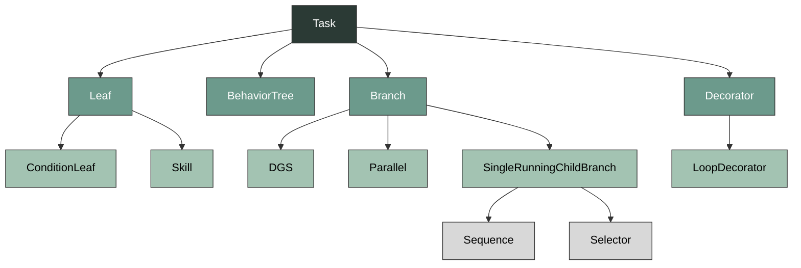

### Leaf

`__init__` 列举了所有状态，状态被用作 condition:

*   `robot_status`
    *   硬件
    *   进场状态
*   `ball_status`
    *   有没有看到
    *   在哪个位置
    *   离机器人的位置
*   `gc_status`
    *   裁判盒发不同指令的情形
*   `team_status`
    *   队友状态
    *   至少有一个队员看到球
*   `field_status`
    *   看到中圈
    *   看到球门？

### DBlackboard (dblackboard.py)

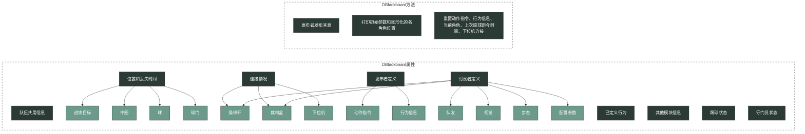

---

## Role 各角色执行逻辑

### 行为树图例

任务 (Task) 是行为树的基本单位，行为树的任意子树（包括整棵树和任一叶子节点）都是一个任务。（可参考上面的“继承关系”）

*   **Guard**: 技能的进入条件
*   **Exit**: 技能的退出条件
*   **机器人技能**: (简单技能和复杂技能均用浅蓝色框表示)
*   **Branch**: 枝干节点，决定子任务的执行顺序
    *   **DGS (DynamicGuardSelector)**: 执行第一个 Guard 为 True 的子任务，执行成功后重置
    *   **P (Parallel)**: 依次运行所有子任务
    *   **SI (Selector)**: 依次执行子任务，有一个成功执行即返回 Succeed；均失败则返回 Fail
    *   **Sq (Sequence)**: 依次执行子任务，有一个失败即返回 Fail；均成功则返回 Succeed
*   **Decorator**: 修饰器，修饰子任务的执行结果
    *   **Inv (Inverse)**: 反转真值，True->False, False->True
*   **决定复合条件的返回值**: 叫 Guard，但是 Guard 和 Exit 通用
    *   **GSI (GuardSelector)**: 子条件有一个为 True 就为 True
    *   **GSq (GuardSequence)**: 子条件均为 True 才为 True

### Game

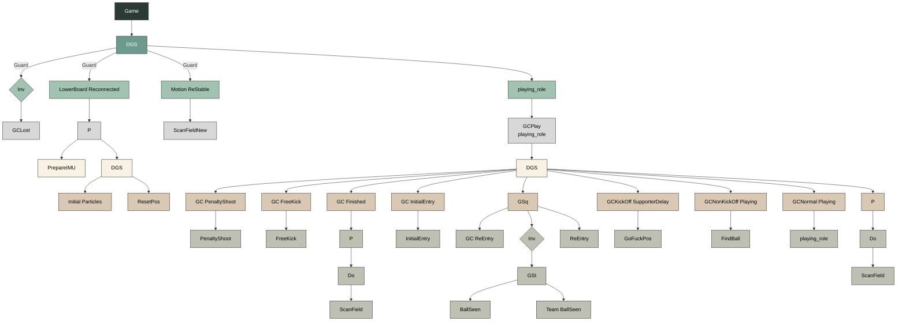

### GoalKeeper

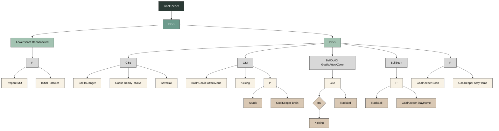

---

## Skill 各种技能

### 简单技能

### 复杂技能的技能树

#### AssistBall (assist.py)
助攻

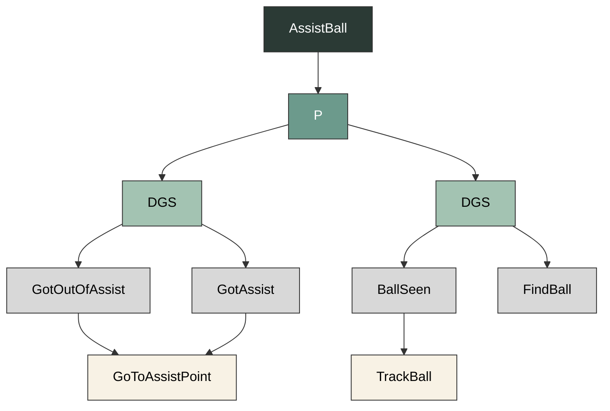

`class AssistBall(Parallel)`:
总任务

`class GoToAssistPoint(Skill)`
根据球的位置和机器人角色计算出助攻点，并让机器人走过去

**Properties:**
助攻半径 `assist_radius` (r)，传球距离 `pass_dis`，远离标准 `far_from_ball`，是否踢球 `shoot_ball`

**Communication:**
1. from vision: 机器人位置 `robot_pos`

**Method:**
1. 先计算出球的全局位置，设定进攻目标点，算出目标点指向球的矢量。
2. 随后分角色处理：`GoalKeeper` 不助攻；`Defender` 去球被敌方推进到的下一个位置下方 r 处，不踢球；对于 `Supporter` 和 `Striker`，如果球离球门较远，去球的前面（有什么用？）；离球门较近时，去球的后面。`Striker` 去球的下方，`Supporter` 去球的上方。
3. 若机器人已经在助攻点，则原地不动；若不在，则发送去助攻点的动作指令。

`class GotAssist(ConditionLeaf)`
到达助攻点。

`class GotOutOfAssist(ConditionLeaf)`
不在助攻点。

#### Strike

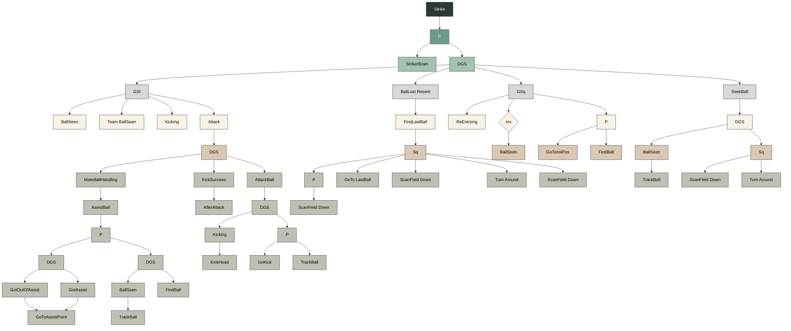

#### Defend

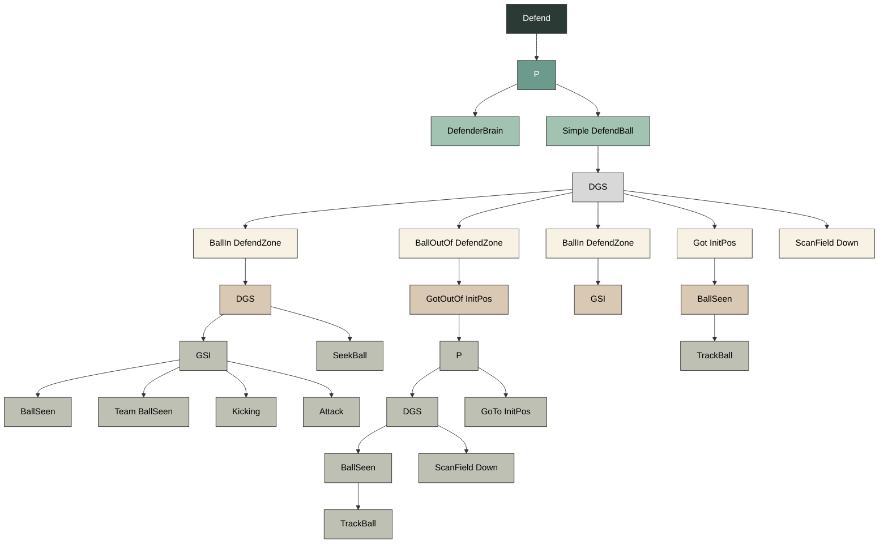

#### SeekBall (seek_ball.py)
找球

`class SeekBall(DynamicGuardSelector)`
总任务。

`class TurnAround(Skill)`
机器人整体转过一个目标角后停止。

**Properties:**
*   起始角 `started_angle` 初始化为机器人面对的方向
*   转过的角 `TARGET_ANGLE_DELTA`
*   目标角 `target_angle`，上面两者之和

**Method:**
机器人整体转过一个目标角后停止。

`class TurnTo(Skill)`
机器人整体转到一个目标角后停止。

`class ScanField(Skill)`
依次扫描一个列表中的所有点。其他含有 `ScanField` 的类均为其子类，仅用于修改 properties 的水平。

**Properties:**
*   在一个点的停留时间 `timeout`
*   计时器 `timer = Timer(timeout)`
*   扫描点列表 `gaze_plats = [VecPos(15, 90), VecPos(15, 0), VecPos(15, -90)]`
*   迭代器 `iter`
*   当前扫描点 `cur_plat`
*   是否保持观察 `keep`
*   头的转速 `pitch_speed`

**Methods: ???**
转头以看向 `gaze_plats` 的一个点，如果已经到了，则计一段 `timeout` 时间，到时间后将当前扫描点改为下一个。若扫描到最后一个点，则反转 `gaze_plats` 元素顺序继续扫描。

`class TrackBall(Skill)`
通过旋转头部保证球在机器人视野中央。

**Properties:**
阈值 `self.TRACK_THRESH`，头的转速 `self.speed`

**Communication:**
1. From vision: 球相对机器人的位置 `ball_field`，以及由此位置算出的头部追踪俯仰角 `track` (确实是在 vision 算的)
2. From motion: 头部当前俯仰角 `cur_plat`

**Method:**
若 `ball_field` 在中央，则固定；若不在中央，比较 `cur_plat` 和 `track`，要求它们的差距在阈值内，否则通过 `look_at` 修改动作指令 `action_cmd.headCmd` 以调整。

`class GoToLastBall(Skill)`
若此时看不到球，则去最后一次看到球的位置

**Properties:**
阈值 `self.TRACK_THRESH` (没用到)

**Communication:**
通过 `goto_global` 修改动作指令 `action_cmd.bodyCmd`

**Method:**
若此时看不到球，则去 `dblackboard` 上保存的最后一次看到球的位置，若没有这一位置则报错。

`class FindBall(DynamicGuardSelector)`
看到球则头跟着球转，看不到则扫描场地来找球
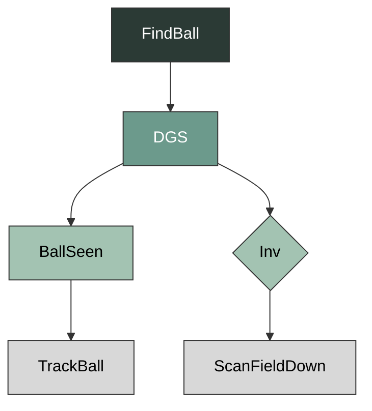

`class FindLastBall(Sequence)`
一边扫描场地一边去最后一次看到球的位置。过去之后扫描场地，转身，再扫描场地
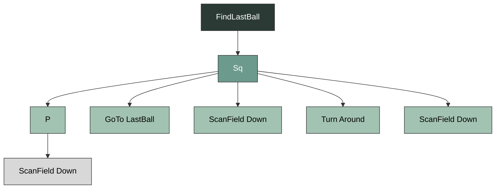

#### AttackBall (attack_ball.py && kick.py)

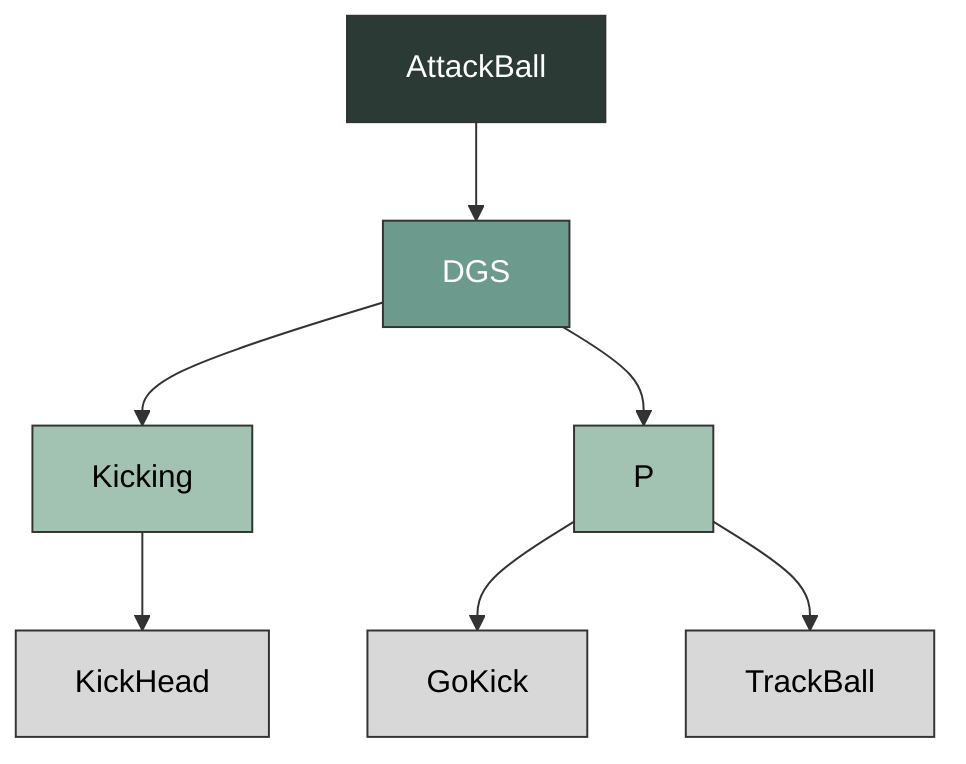

`class AttackBall(DynamicGuardSelector)`
总任务

`class AfterAttack(Parallel)`
先回到正常站立状态，再接着找球

`class KickBrain(Skill)` (未被调用)

`class EnableKick(Condition)` (未被调用)

`class KickHead(Skill)`
踢球时头部动作。
看向 pitch=15, yaw=0 的位置，同时将自己的 `team_play_state` 设为 KICKING (未实现)

`class GoKick(Skill)`
朝球走过去并踢球。

**Communication:**
1. From vision: 球的全局位置 `ball_global`

**Method:**
从 `dblackboard` 获取进攻目标点 `attack_target`。计算 `ball->target` 矢量及其方位角，方位角作为踢球方向。将球的位置和踢球方向用 `action_generator.kick`_ball` 打包好生成动作指令。

`class KickSide(Skill)` (未被调用)
朝左/右踢球(传给队友)

#### GoalKeeper (goal_keeper.py)

`class GoalKeeper(Role)`
总任务

`class GoalKeeperBase()`
守门员所在的禁区信息

**Properties:**
*   `attack_margin`: 表示球相对于球门区域的位置，守门员应该进攻的位置。它是一个 `VecPos` 对象，具有 x 和 y 坐标。
*   `attack_margin_hys`: 表示添加到进攻边界的滞后值。
*   `home_pos`: 表示守门员的待命位置。
*   `home_x` 和 `home_y`: 表示等待的距离到球门线的距离。
*   `home_dis_max` 和 `home_angle_max`: 表示等待的最大可接受距离和角度。
*   `home_dis_max_hys` 和 `home_angle_max_hys`: 表示最大可接受距离和角度的滞后值。
*   `next_state_size` 和 `next_state`: 表示用于平滑下一个状态变化的缓冲区的长度和存储下一个状态的 deque。
*   `ball_ignore_x`: 表示守门员应忽略球的 x 坐标位置。
*   `ball_ignore_x_hys`: 表示忽略球的滞后距离。
*   `align_tol`: 表示将守门员位置与最佳点对齐的容差值。
*   `kick_dis_max`: 表示对于最大射门距离。
*   `target`: 表示守门员的目标位置。
*   `target_smoothing_coff`: 表示用于平滑目标位置的系数。
*   `margin_xy`: 表示从放置者得到的值。
*   `state`: 表示守门员当前的状态。
*   `timer`: 表示计时器对象。
*   `home_pos`: 表示守门员的待命位置。

**Method:**
`buffered_set_state(self, state)` 向状态队列里添加新状态

`class BallInDanger(ConditionLeaf)` 测一下场地上球的加速度？
默认草地上球的加速度为 `-40cm/s^2` (可以灵活调整，加速度绝对值越小 BallInDanger 越容易为 True)
计算出机器人在 2s 反应时间后作出反应时球到达的 x 位置，若 x 为负，则返回 True。

`class GoalieReadyToSave(ConditionLeaf, GoalKeeperBase)`
若机器人在球门前方 (y 坐标在球门宽度范围内) 且面朝球门外侧，则返回 True。
算出了待命位置的全局坐标赋给 `home_pos`，但不在这里用到。

`class SaveBall(Skill)`
```python
if ballv.x > -15:
    return Status.RUNNING
```
通过球的速度和在机器人坐标系中的位置，计算出球到机器人坐标系 y 轴时的 y 坐标，来决定向左倒/向右倒/正面防守。倒的条件或许可以严格一点，因为 Attack 也有防守效果且可把球踢出；正面防守没有动作，结束 Saveball，DGS 会接着选取 Attack 来防守。

**Graph1 SaveBall**
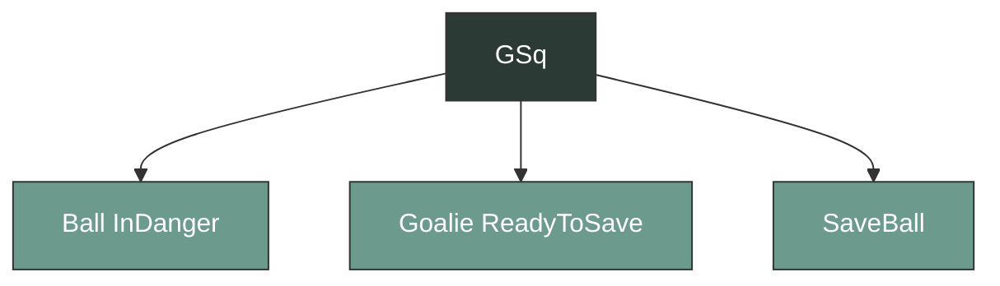

`class BallInGoalieAttackZone(ConditionLeaf)`
用球在机器人坐标系中的位置算

`class BallOutOfGoalieAttackZone(ConditionLeaf)`
用球的全局位置算

`class GoalKeeperBrain(Skill)`
与 StrikerBrain/DefenderBrain 类似，但目标点不同：
默认为 `VecPos(0, 300)`，以避免踢到对方进攻队员身上。若球偏离场地 x 轴达到一定程度，则目标点也朝同一方向偏移一些。

**Graph2 Attack**
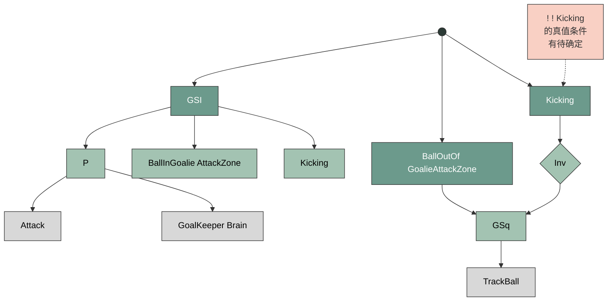

`class GoalKeeperStayHome(DynamicGuardSelector)`
这部分的总任务，保证守门员在没有其他任务的条件下回到待命点，见下图。

**Graph3 Others**
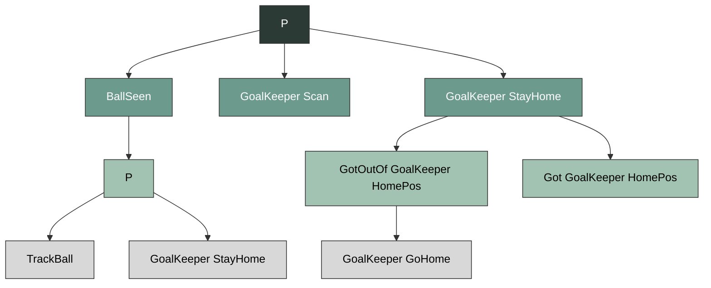

`class GoalKeeperScan(ScanField)`
是 `ScanField` 的子类，提供了新的一些扫描点，父类 `ScanField` 请参阅 `SeekBall` 技能。

`class GoalKeeperGoHome(Walk, GoalKeeperBase)`
回到待命点。

`class GotGoalKeeperHomePos(ConditionLeaf, GoalKeeperBase)`
在待命点且面朝球门外侧。

`class GotOutOfGoalKeeperHomePos(ConditionLeaf, GoalKeeperBase)`
不在待命点或面朝球门内侧。

`class GoalKeeperAlign(GoalKeeperBase)`

`class KeepGoal(DynamicGuardSelector)`

`class KeepGoalLogic(Parallel)`

#### Util utility 多功能工具包

`action_generator`: 指令生成器

`parameter`:
不连裁判盒的情况

---

### Striker & Supporter

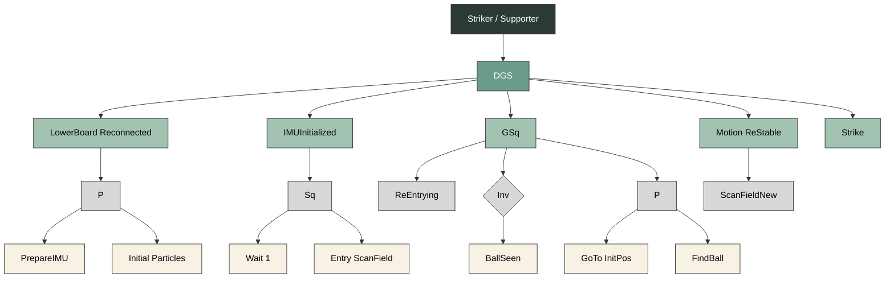

### Defender

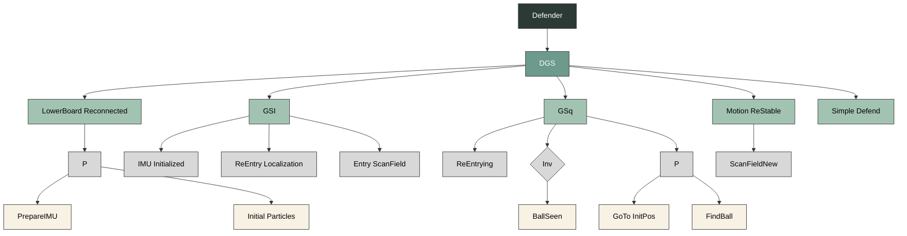