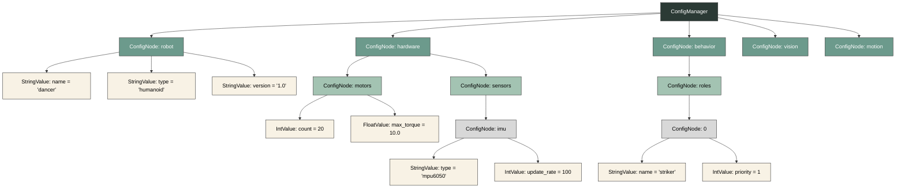
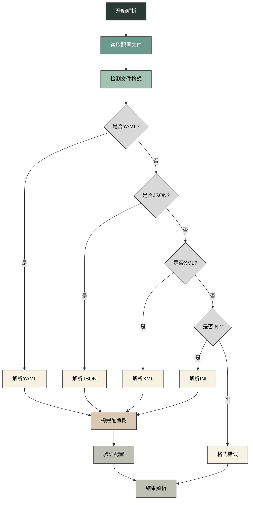
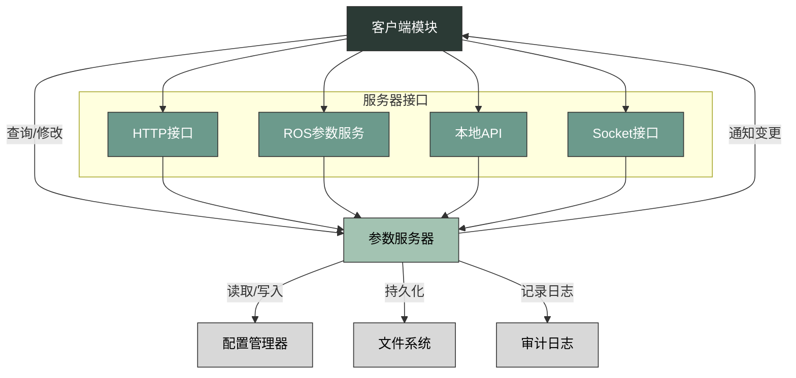
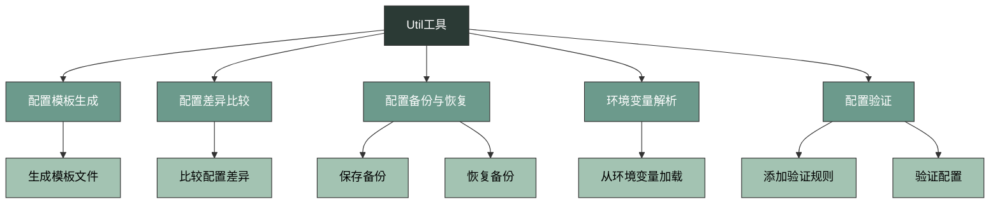
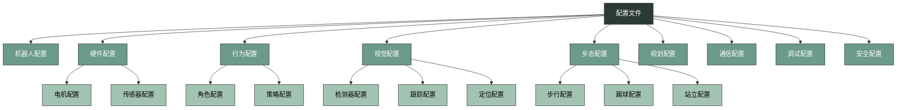
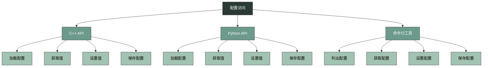
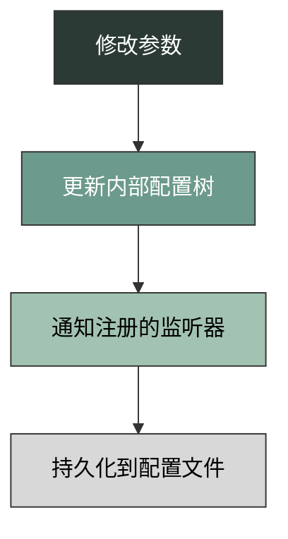
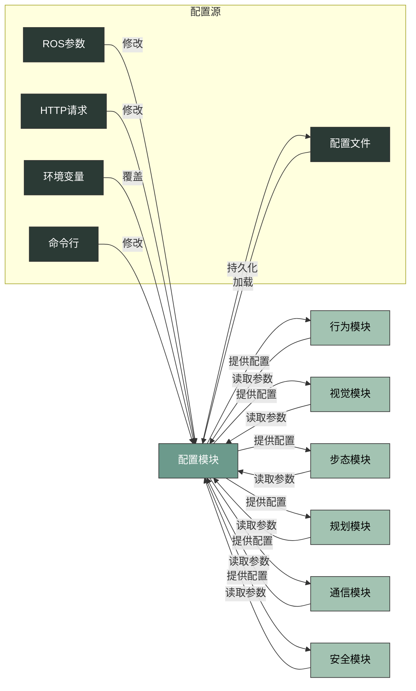

***

# Config module

## Overview

`dconfig` 是机器人系统的配置模块，负责管理所有模块的参数配置。

### 核心组件

*   `core`: 核心配置管理，负责参数的加载、存储与访问
*   `parser`: 配置文件解析器，支持多种格式
*   `server`: 参数服务器，提供运行时参数调整
*   `util`: 工具函数与辅助类

### 工作流程

0. 初始化：加载默认配置文件，初始化配置管理器
1. 解析：解析配置文件，存储到内部数据结构
2. 服务启动：启动参数服务器，提供查询与修改接口
3. 参数访问：其他模块获取所需参数
4. 动态调整：运行中支持参数调整并实时生效
5. 持久化：保存修改后的参数到配置文件

## Core

core 组件是配置模块的核心，负责参数的管理与访问，采用树形结构组织配置数据。

### 核心类

*   `ConfigManager`: 配置管理核心类，负责全局配置的管理
*   `ConfigNode`: 配置树中的节点，可包含子节点或值
*   `ConfigValue`: 配置值基类，支持多种数据类型

### 配置树结构

配置数据采用树形结构组织，根节点是 `ConfigManager`，下面是各个配置节点，叶子节点是具体的配置值。

## Parser

parser 组件负责解析不同格式的配置文件，支持多种格式，提供统一的解析接口。

### 支持的格式

*   **YAML**: 人类友好的数据序列化标准
*   **JSON**: 轻量级的数据交换格式
*   **XML**: 可扩展标记语言
*   **INI**: 简单的键值对配置格式

### 解析器类

*   `YamlParser`: 解析 YAML 格式
*   `JsonParser`: 解析 JSON 格式
*   `XmlParser`: 解析 XML 格式
*   `IniParser`: 解析 INI 格式

### 解析流程

### 自动格式检测

解析器可根据文件扩展名或内容自动检测配置文件格式：

| 文件扩展名 | 格式 |
|------------|------|
| .yaml, .yml | YAML |
| .json | JSON |
| .xml | XML |
| .ini | INI |

## Server

server 组件提供运行时参数的动态调整能力，支持多种通信协议。

### 核心功能

*   参数的实时查询与修改
*   参数变更的通知机制
*   参数的持久化存储
*   权限控制
*   审计日志

### 服务器架构

### 接口详情

*   **HTTP 接口**：通过 HTTP 协议访问配置参数，默认端口 8080
*   **ROS 参数服务**：通过 ROS 参数服务访问配置参数，命名空间 /dancer/config
*   **本地 API**：通过 C++ API 访问配置参数，高性能，无网络开销
*   **Socket 接口**：通过 Socket 协议访问配置参数

## Util

util 组件提供了一系列工具函数与辅助类，用于配置相关的辅助功能。

### 工具类

*   `ConfigTemplateGenerator`: 根据默认值生成配置模板文件
*   `ConfigDiff`: 比较两个配置文件的差异
*   `ConfigBackup`: 备份当前配置，在需要时恢复
*   `EnvParser`: 从环境变量中读取配置
*   `ConfigValidator`: 验证配置的有效性

### 工具流程

## 配置文件结构

配置文件采用分层结构，按照功能模块组织配置项。

### 配置层次结构

## 配置访问接口

配置模块提供了多种访问接口，满足不同场景的需求。

### 访问接口类型

*   **C++ API**：模块内部直接访问配置，高性能，类型安全
*   **Python API**：通过 Python 访问配置，方便脚本使用
*   **命令行工具**：通过命令行访问配置，快速查看和修改配置

### 访问流程

## 运行时参数调整

配置模块支持运行时动态调整参数，无需重启模块即可生效。

### 实时参数更新流程

### 参数变更通知

模块可以注册配置变更监听器，当特定配置项变更时收到通知。

### 参数持久化

配置模块支持自动或手动持久化配置变更：
*   **自动持久化**：当参数变更时自动保存到配置文件
*   **手动持久化**：通过 API 或命令手动保存配置

## 配置模块与其他模块的关系

配置模块是机器人系统的基础服务，为其他所有模块提供配置支持。

### 配置优先级

配置模块支持多种配置源，按照以下优先级从高到低：
1. 命令行参数
2. 环境变量
3. HTTP/ROS 参数服务
4. 配置文件
5. 默认值

## 常见问题与解决方案

### 常见问题

*   **配置加载失败**：文件格式错误、路径不存在、权限不足、依赖库缺失
*   **参数不生效**：参数路径错误、模块未监听配置变更、模块有缓存机制、参数类型不匹配
*   **配置冲突**：多个配置源设置了相同的参数、配置优先级不明确、配置文件格式不一致
*   **性能问题**：配置树结构复杂、频繁的配置读写操作、配置文件过大

### 解决方案

```mermaid
graph TD
    classDef L1 fill:#2B3A35,color:#fff,stroke:#333,stroke-width:1px;
    classDef L2 fill:#6C9A8C,color:#fff,stroke:#333,stroke-width:1px;
    classDef L3 fill:#A3C3B2,color:#000,stroke:#333,stroke-width:1px;

    Problems[常见问题] --> LoadFailure[配置加载失败]
    Problems --> NotEffective[参数不生效]
    Problems --> Conflict[配置冲突]
    Problems --> Performance[性能问题]

    LoadFailure --> CheckFormat[检查文件格式]
    LoadFailure --> CheckPath[确认文件路径]
    LoadFailure --> CheckPermission[检查文件权限]
    LoadFailure --> InstallDependencies[安装依赖库]

    NotEffective --> CheckPathParam[检查参数路径]
    NotEffective --> RegisterListener[注册配置变更监听器]
    NotEffective --> RefreshCache[刷新模块缓存]
    NotEffective --> CheckType[确认参数类型]

    Conflict --> ClearPriority[明确配置优先级]
    Conflict --> UnifiedInterface[统一配置管理接口]
    Conflict --> ConsistentFormat[确保配置文件格式一致]

    Performance --> OptimizeStructure[优化配置树结构]
    Performance --> UseLocalAPI[使用本地API访问]
    Performance --> SplitConfig[分割大型配置文件]
    Performance --> UseCache[使用配置缓存]

    class Problems L1;
    class LoadFailure,NotEffective,Conflict,Performance L2;
    class CheckFormat,CheckPath,CheckPermission,InstallDependencies,CheckPathParam,RegisterListener,RefreshCache,CheckType,ClearPriority,UnifiedInterface,ConsistentFormat,OptimizeStructure,UseLocalAPI,SplitConfig,UseCache L3;
```

