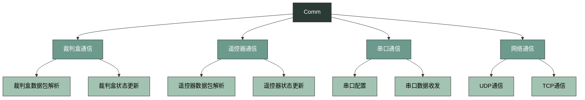
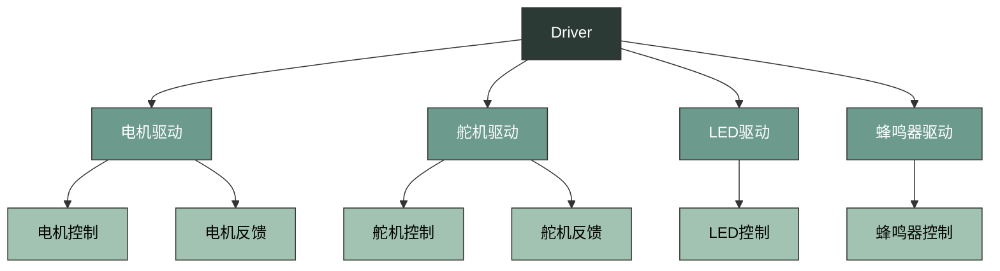
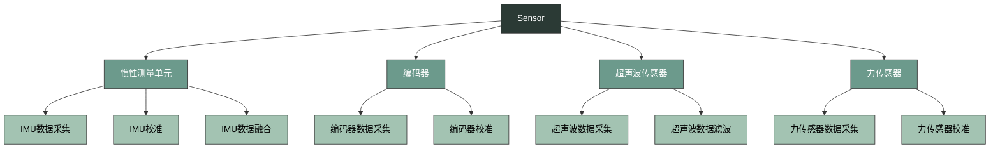
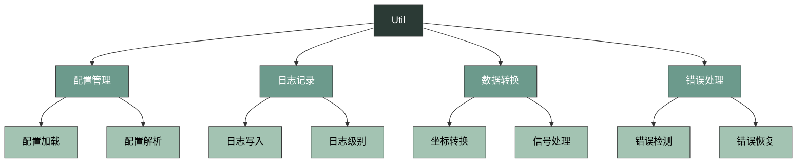
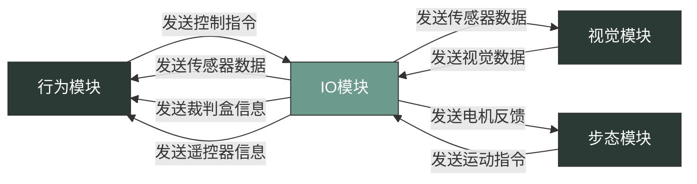

***

# IO module

## Overview

`dio` 是我们的输入输出模块，其主要负责机器人与外部设备的通信和数据交换，为机器人的各个模块提供必要的输入信息，并将处理结果输出到相应的设备或模块。作为机器人系统的"神经系统"，IO模块确保了机器人能够与外部环境进行有效交互，并将内部各个模块连接成一个有机整体。

主要由以下组件组成：

*   `comm`: 通信模块，负责与外部设备的通信，如裁判盒、遥控器、上位机等
*   `driver`: 设备驱动，负责控制各种硬件设备，如电机、舵机、LED等
*   `sensor`: 传感器数据处理，负责读取和处理传感器数据，如IMU、编码器、超声波等
*   `util`: 工具函数和辅助类，提供配置管理、日志记录、数据转换等功能

整个IO模块的运转流程如下：

0. **初始化阶段**：加载配置参数，初始化各个驱动和通信模块，建立与外部设备的连接
1. **传感器数据采集**：通过各种传感器获取环境信息，如IMU、编码器等
2. **数据处理**：对采集到的传感器数据进行滤波、校准等操作，确保数据的准确性和可靠性
3. **外部指令接收**：通过通信模块接收外部指令，如裁判盒信息、遥控器指令等
4. **数据发布**：将处理后的数据通过ROS Topic发送给其他模块，如行为模块、视觉模块等
5. **执行控制指令**：接收其他模块的控制指令，驱动相应的硬件设备，实现机器人的运动和操作
6. **循环执行**：一个运行周期结束，重复步骤1-5，确保系统持续运行

IO模块的设计遵循模块化、可扩展性和可靠性原则，通过清晰的接口定义和层次结构，使得各个组件能够独立开发和测试，同时又能无缝协作，为机器人系统提供稳定的输入输出能力。

## 核心组件

### Comm 通信模块

通信模块负责与外部设备的通信，包括裁判盒、遥控器、上位机等，是机器人与外界交互的重要通道。通信模块采用分层设计，支持多种通信协议和设备类型，确保机器人能够及时接收和处理外部信息。

通信模块的核心功能包括：

1. **数据接收与发送**：通过各种通信接口接收外部设备发送的数据，并将内部数据发送给外部设备
2. **数据包解析**：对接收到的数据包进行解析，提取有用信息
3. **状态管理**：维护与外部设备的通信状态，确保通信的稳定性和可靠性
4. **错误处理**：处理通信过程中出现的各种错误，如连接失败、数据丢失等
5. **数据同步**：确保数据的实时性和同步性，满足机器人系统对时间敏感任务的要求

通信模块支持多种通信协议，包括：

- **UDP**：用于实时性要求高的场景，如裁判盒通信
- **TCP**：用于可靠性要求高的场景，如上位机通信
- **串口**：用于与底层设备的通信，如电机控制器
- **USB**：用于与遥控器等设备的通信

### Driver 设备驱动

设备驱动负责控制各种硬件设备，包括电机、舵机、LED等，是机器人执行机构的控制核心。设备驱动模块通过标准化的接口，将上层控制指令转换为底层硬件可执行的控制信号，同时采集硬件的反馈信息，实现闭环控制。

设备驱动模块的核心功能包括：

1. **设备初始化**：初始化硬件设备，设置初始参数和状态
2. **控制信号生成**：根据上层指令生成相应的控制信号
3. **反馈数据采集**：采集硬件设备的反馈数据，如电机速度、舵机角度等
4. **闭环控制**：根据反馈数据调整控制信号，实现精确控制
5. **故障检测**：检测硬件设备的故障状态，如过载、过温等

设备驱动模块支持多种硬件设备，包括：

- **电机**：用于驱动机器人运动，如轮式机器人的驱动轮、机械臂的关节等
- **舵机**：用于精确控制角度，如机械臂的关节、机器人的头部等
- **LED**：用于状态指示、视觉效果等
- **蜂鸣器**：用于声音提示、警报等

### Sensor 传感器数据处理

传感器数据处理负责读取和处理各种传感器数据，如IMU、编码器、超声波等，是机器人感知环境的重要手段。传感器数据处理模块通过对原始传感器数据的采集、校准、滤波和融合，为机器人提供准确的环境信息和自身状态信息。

传感器数据处理模块的核心功能包括：

1. **数据采集**：从各种传感器读取原始数据
2. **数据校准**：对传感器数据进行校准，消除系统误差
3. **数据滤波**：对传感器数据进行滤波，消除噪声干扰
4. **数据融合**：将多种传感器数据进行融合，提高数据的准确性和可靠性
5. **数据发布**：将处理后的数据通过ROS Topic发布给其他模块

传感器数据处理模块支持多种传感器类型，包括：

- **IMU**：惯性测量单元，用于测量机器人的姿态、角速度和加速度
- **编码器**：用于测量电机的旋转角度和速度
- **超声波传感器**：用于测量距离，检测障碍物
- **力传感器**：用于测量力和力矩，实现力控制

传感器数据处理模块采用模块化设计，每种传感器都有专门的处理逻辑，同时提供统一的接口，便于添加新的传感器类型。

### Util 工具模块

工具模块提供各种辅助功能，如配置管理、日志记录、数据转换等，是IO模块的基础设施。工具模块通过提供通用的功能和工具，简化了其他模块的开发和维护，提高了系统的可扩展性和可维护性。

工具模块的核心功能包括：

1. **配置管理**：加载、解析和管理配置文件，提供统一的配置访问接口
2. **日志记录**：记录系统运行状态和错误信息，便于调试和问题定位
3. **数据转换**：提供各种数据转换功能，如坐标转换、信号处理等
4. **错误处理**：检测和处理系统运行过程中的错误，提高系统的鲁棒性

工具模块的设计遵循通用化和标准化原则，提供的功能可以被其他模块复用，减少代码冗余，提高代码质量。

## 代码组成

### 类的继承关系

```mermaid
graph TD
    classDef L1 fill:#2B3A35,color:#fff,stroke:#333,stroke-width:1px;
    classDef L2 fill:#6C9A8C,color:#fff,stroke:#333,stroke-width:1px;
    classDef L3 fill:#A3C3B2,color:#000,stroke:#333,stroke-width:1px;
    classDef L4 fill:#D8D8D8,color:#000,stroke:#333,stroke-width:1px;
    classDef L5 fill:#F8F2E5,color:#000,stroke:#333,stroke-width:1px;
    classDef L6 fill:#D9C8B4,color:#000,stroke:#333,stroke-width:1px;
    classDef L7 fill:#BEC0B4,color:#000,stroke:#333,stroke-width:1px;

    IOBase --> CommBase
    IOBase --> DriverBase
    IOBase --> SensorBase
    IOBase --> UtilBase

    CommBase --> RefBoxComm
    CommBase --> JoystickComm
    CommBase --> SerialComm
    CommBase --> NetworkComm

    DriverBase --> MotorDriver
    DriverBase --> ServoDriver
    DriverBase --> LEDDriver
    DriverBase --> BuzzerDriver

    SensorBase --> IMU
    SensorBase --> Encoder
    SensorBase --> Ultrasonic
    SensorBase --> ForceSensor

    UtilBase --> Config
    UtilBase --> Logger
    UtilBase --> DataConvert
    UtilBase --> ErrorHandling

    class IOBase L1;
    class CommBase,DriverBase,SensorBase,UtilBase L2;
    class RefBoxComm,JoystickComm,SerialComm,NetworkComm,MotorDriver,ServoDriver,LEDDriver,BuzzerDriver,IMU,Encoder,Ultrasonic,ForceSensor,Config,Logger,DataConvert,ErrorHandling L3;
```

### 核心类详解

#### Comm 通信模块

##### RefBoxComm (refbox_comm.cpp)

**核心功能**：与裁判盒进行通信，接收裁判盒发送的比赛信息，如比赛状态、得分、倒计时等。裁判盒通信是机器人参与比赛的重要环节，确保机器人能够及时响应比赛规则和裁判指令。

**关键方法**：
- `Init()`: 初始化裁判盒通信，建立网络连接，设置通信参数
- `Process()`: 处理裁判盒数据，解析数据包，更新比赛状态
- `GetGameStatus()`: 获取当前比赛状态，如准备、开始、暂停、结束等
- `GetCommand()`: 获取裁判盒指令，如开始比赛、暂停比赛、恢复比赛等
- `GetScore()`: 获取当前比赛得分
- `GetRemainingTime()`: 获取比赛剩余时间

**通信流程**：
1. **初始化**：加载裁判盒IP地址和端口号等配置参数
2. **建立连接**：与裁判盒建立UDP网络连接
3. **接收数据**：接收裁判盒发送的数据包
4. **解析数据**：解析数据包，提取比赛信息，如比赛状态、得分、倒计时等
5. **更新状态**：根据解析结果更新比赛状态和指令
6. **发布数据**：将比赛信息通过ROS Topic发布给其他模块
7. **错误处理**：处理通信过程中出现的错误，如连接失败、数据丢失等

##### JoystickComm (joystick_comm.cpp)

**核心功能**：与遥控器进行通信，接收遥控器发送的控制指令，如移动、转向、操作等。遥控器通信是人机交互的重要方式，允许操作人员实时控制机器人。

**关键方法**：
- `Init()`: 初始化遥控器通信，打开遥控器设备
- `Process()`: 处理遥控器数据，解析控制指令
- `GetJoystickData()`: 获取遥控器数据，包括摇杆位置、按钮状态等
- `IsButtonPressed()`: 检查按钮是否按下
- `GetAxisValue()`: 获取摇杆轴值

**通信流程**：
1. **初始化**：加载遥控器配置参数，如设备路径、按键映射等
2. **打开设备**：打开遥控器设备，建立通信通道
3. **读取数据**：读取遥控器发送的原始数据
4. **解析数据**：解析数据，提取控制指令，如摇杆位置、按钮状态等
5. **处理数据**：对解析后的数据进行处理，如映射到机器人的控制量
6. **发布数据**：将控制指令通过ROS Topic发布给其他模块
7. **错误处理**：处理通信过程中出现的错误，如设备未连接、数据异常等

##### SerialComm (serial_comm.cpp)

**核心功能**：通过串口与底层设备进行通信，如电机控制器、传感器等。串口通信是一种可靠的通信方式，适用于短距离、低速率的通信场景。

**关键方法**：
- `Init()`: 初始化串口通信，设置串口参数
- `SendData()`: 发送数据到串口设备
- `ReceiveData()`: 从串口设备接收数据
- `Process()`: 处理串口数据

**通信流程**：
1. **初始化**：加载串口配置参数，如端口号、波特率、数据位、停止位等
2. **打开串口**：打开串口设备，建立通信通道
3. **配置串口**：设置串口参数，确保通信正常
4. **发送数据**：将控制指令发送给底层设备
5. **接收数据**：接收底层设备的反馈数据
6. **处理数据**：解析和处理接收到的数据
7. **错误处理**：处理通信过程中出现的错误，如串口未连接、数据校验失败等

##### NetworkComm (network_comm.cpp)

**核心功能**：通过网络与上位机或其他设备进行通信，支持UDP和TCP协议。网络通信是一种灵活的通信方式，适用于长距离、高速率的通信场景。

**关键方法**：
- `Init()`: 初始化网络通信，设置网络参数
- `SendData()`: 发送数据到网络设备
- `ReceiveData()`: 从网络设备接收数据
- `Process()`: 处理网络数据

**通信流程**：
1. **初始化**：加载网络配置参数，如IP地址、端口号、协议类型等
2. **建立连接**：根据协议类型建立网络连接（UDP无需建立连接）
3. **发送数据**：将数据发送给网络设备
4. **接收数据**：接收网络设备的反馈数据
5. **处理数据**：解析和处理接收到的数据
6. **错误处理**：处理通信过程中出现的错误，如网络连接失败、数据丢失等

#### Driver 设备驱动

##### MotorDriver (motor_driver.cpp)

**核心功能**：控制机器人的电机，实现机器人的运动，如前进、后退、转向等。电机驱动是机器人运动系统的核心，确保机器人能够按照预期的速度和方向运动。

**关键方法**：
- `Init()`: 初始化电机驱动，设置电机参数，如PID参数、速度限制等
- `SetSpeed()`: 设置电机速度，控制电机的旋转速度
- `GetSpeed()`: 获取电机当前速度，用于闭环控制
- `GetPosition()`: 获取电机当前位置，用于位置控制
- `Stop()`: 停止电机，紧急情况下使用

**控制流程**：
1. **接收指令**：接收行为模块或步态模块发送的运动指令
2. **解析指令**：解析指令，计算电机目标速度
3. **生成控制信号**：根据目标速度和当前速度，生成控制信号
4. **发送控制信号**：将控制信号发送到电机控制器
5. **读取反馈数据**：读取电机的反馈数据，如当前速度、位置等
6. **闭环控制**：根据反馈数据调整控制信号，实现精确控制
7. **错误处理**：处理电机运行过程中出现的错误，如过载、过温等

##### ServoDriver (servo_driver.cpp)

**核心功能**：控制机器人的舵机，实现机器人的姿态调整，如机械臂的关节角度、机器人的头部方向等。舵机驱动是机器人姿态控制系统的核心，确保机器人能够保持正确的姿态。

**关键方法**：
- `Init()`: 初始化舵机驱动，设置舵机参数，如角度范围、速度限制等
- `SetAngle()`: 设置舵机目标角度，控制舵机的旋转角度
- `GetAngle()`: 获取舵机当前角度，用于闭环控制
- `SetSpeed()`: 设置舵机旋转速度，控制舵机的运动速度

**控制流程**：
1. **接收指令**：接收行为模块发送的姿态指令
2. **解析指令**：解析指令，计算舵机目标角度
3. **生成控制信号**：根据目标角度和当前角度，生成控制信号
4. **发送控制信号**：将控制信号发送到舵机控制器
5. **读取反馈数据**：读取舵机的反馈数据，如当前角度等
6. **闭环控制**：根据反馈数据调整控制信号，实现精确控制
7. **错误处理**：处理舵机运行过程中出现的错误，如角度超限、过载等

##### LEDDriver (led_driver.cpp)

**核心功能**：控制机器人的LED灯，实现状态指示、视觉效果等。LED驱动是机器人人机交互的重要组成部分，通过灯光变化向操作人员传递机器人的状态信息。

**关键方法**：
- `Init()`: 初始化LED驱动，设置LED参数
- `SetColor()`: 设置LED颜色，控制LED的发光颜色
- `SetBlink()`: 设置LED闪烁模式，控制LED的闪烁频率和方式
- `TurnOn()`: 打开LED
- `TurnOff()`: 关闭LED

**控制流程**：
1. **接收指令**：接收其他模块发送的LED控制指令
2. **解析指令**：解析指令，确定LED的颜色、闪烁模式等
3. **生成控制信号**：根据指令生成控制信号
4. **发送控制信号**：将控制信号发送到LED控制器
5. **执行控制**：LED控制器执行控制信号，控制LED的状态

##### BuzzerDriver (buzzer_driver.cpp)

**核心功能**：控制机器人的蜂鸣器，实现声音提示、警报等。蜂鸣器驱动是机器人音频输出的重要组成部分，通过声音向操作人员传递机器人的状态信息。

**关键方法**：
- `Init()`: 初始化蜂鸣器驱动，设置蜂鸣器参数
- `PlayTone()`: 播放特定音调，控制蜂鸣器的发声频率和持续时间
- `PlaySequence()`: 播放音调序列，实现复杂的声音效果
- `Stop()`: 停止蜂鸣器发声

**控制流程**：
1. **接收指令**：接收其他模块发送的蜂鸣器控制指令
2. **解析指令**：解析指令，确定蜂鸣器的音调、持续时间等
3. **生成控制信号**：根据指令生成控制信号
4. **发送控制信号**：将控制信号发送到蜂鸣器控制器
5. **执行控制**：蜂鸣器控制器执行控制信号，控制蜂鸣器的发声

#### Sensor 传感器数据处理

##### IMU (imu.cpp)

**核心功能**：读取IMU（惯性测量单元）数据，实现机器人的姿态估计，如翻滚角、俯仰角、偏航角等。IMU是机器人导航和姿态控制的重要传感器，为机器人提供准确的姿态信息。

**关键方法**：
- `Init()`: 初始化IMU，加载校准参数，设置采样率等
- `Update()`: 更新IMU数据，采集和处理最新的传感器数据
- `GetOrientation()`: 获取机器人姿态，返回四元数或欧拉角
- `GetAngularVelocity()`: 获取角速度，返回三个轴的角速度
- `GetLinearAcceleration()`: 获取线加速度，返回三个轴的线加速度
- `GetCalibrationData()`: 获取IMU校准数据

**数据处理流程**：
1. **数据采集**：读取IMU原始数据，包括加速度计、陀螺仪和磁力计数据
2. **数据校准**：对原始数据进行校准，消除传感器的系统误差
3. **数据滤波**：对校准后的数据进行滤波，消除噪声干扰
4. **传感器融合**：使用传感器融合算法（如卡尔曼滤波器、互补滤波器）融合加速度计、陀螺仪和磁力计数据，估计机器人姿态
5. **数据发布**：将处理后的数据通过ROS Topic发布给其他模块
6. **错误处理**：检测和处理IMU数据异常，如数据超出范围、传感器故障等

##### Encoder (encoder.cpp)

**核心功能**：读取编码器数据，实现机器人的位置估计和速度测量。编码器是机器人运动控制的重要传感器，为机器人提供准确的位置和速度信息。

**关键方法**：
- `Init()`: 初始化编码器，设置分辨率、方向等参数
- `Update()`: 更新编码器数据，采集和处理最新的传感器数据
- `GetCount()`: 获取编码器计数，返回原始计数值
- `GetSpeed()`: 获取电机速度，返回当前速度值
- `GetPosition()`: 获取电机位置，返回当前位置值
- `ResetCount()`: 重置编码器计数，用于位置校准

**数据处理流程**：
1. **数据采集**：读取编码器原始数据，获取计数值
2. **数据校准**：对原始数据进行校准，消除编码器的系统误差
3. **数据滤波**：对校准后的数据进行滤波，消除噪声干扰
4. **速度计算**：根据计数变化率计算电机速度
5. **位置计算**：根据计数值计算电机位置
6. **数据发布**：将处理后的数据通过ROS Topic发布给其他模块
7. **错误处理**：检测和处理编码器数据异常，如计数跳变、传感器故障等

##### Ultrasonic (ultrasonic.cpp)

**核心功能**：读取超声波传感器数据，实现距离测量和障碍物检测。超声波传感器是机器人避障的重要传感器，为机器人提供周围环境的距离信息。

**关键方法**：
- `Init()`: 初始化超声波传感器，设置触发和接收参数
- `Update()`: 更新超声波传感器数据，采集和处理最新的传感器数据
- `GetDistance()`: 获取测量距离，返回当前距离值
- `IsObstacleDetected()`: 检测是否有障碍物

**数据处理流程**：
1. **发送触发信号**：向超声波传感器发送触发信号，启动测量
2. **接收回波信号**：接收超声波传感器的回波信号
3. **计算距离**：根据回波信号的时间差计算距离
4. **数据滤波**：对测量数据进行滤波，消除噪声干扰
5. **障碍物检测**：根据距离值检测是否有障碍物
6. **数据发布**：将处理后的数据通过ROS Topic发布给其他模块
7. **错误处理**：检测和处理超声波传感器数据异常，如测量超时、传感器故障等

##### ForceSensor (force_sensor.cpp)

**核心功能**：读取力传感器数据，实现力和力矩的测量。力传感器是机器人力控制的重要传感器，为机器人提供与环境交互的力信息。

**关键方法**：
- `Init()`: 初始化力传感器，加载校准参数
- `Update()`: 更新力传感器数据，采集和处理最新的传感器数据
- `GetForce()`: 获取力值，返回三个轴的力值
- `GetTorque()`: 获取力矩值，返回三个轴的力矩值

**数据处理流程**：
1. **数据采集**：读取力传感器原始数据
2. **数据校准**：对原始数据进行校准，消除传感器的系统误差
3. **数据滤波**：对校准后的数据进行滤波，消除噪声干扰
4. **力和力矩计算**：根据校准后的数据计算力和力矩
5. **数据发布**：将处理后的数据通过ROS Topic发布给其他模块
6. **错误处理**：检测和处理力传感器数据异常，如数据超出范围、传感器故障等

## 与其他模块的交互

IO模块作为机器人系统的"神经系统"，与其他模块有着密切的交互关系，为其他模块提供必要的输入信息，并执行其他模块的控制指令。

### 与行为模块的交互

行为模块是机器人的"大脑"，负责决策和规划。IO模块与行为模块的交互包括：

1. **接收控制指令**：行为模块根据环境信息和任务要求，生成控制指令，发送给IO模块执行
2. **发送传感器数据**：IO模块将采集和处理后的传感器数据发送给行为模块，为行为决策提供依据
3. **发送裁判盒信息**：IO模块将裁判盒发送的比赛信息发送给行为模块，使行为模块能够根据比赛规则调整策略
4. **发送遥控器信息**：IO模块将遥控器发送的控制指令发送给行为模块，使行为模块能够响应操作人员的指令

### 与视觉模块的交互

视觉模块负责处理摄像头采集的图像信息，识别目标和环境。IO模块与视觉模块的交互包括：

1. **接收视觉数据**：视觉模块将处理后的视觉数据发送给IO模块，如目标位置、障碍物信息等
2. **发送传感器数据**：IO模块将采集和处理后的传感器数据发送给视觉模块，如机器人姿态、位置等，帮助视觉模块进行目标定位和跟踪

### 与步态模块的交互

步态模块负责控制机器人的运动步态，实现机器人的稳定行走。IO模块与步态模块的交互包括：

1. **接收运动指令**：步态模块根据行为模块的要求，生成详细的运动指令，发送给IO模块执行
2. **发送电机反馈**：IO模块将电机的反馈数据发送给步态模块，使步态模块能够调整控制策略，实现稳定的步态控制

IO模块通过ROS Topic与其他模块进行通信，确保数据的实时性和可靠性。每个模块都有明确的职责和接口，使得系统的各个部分能够协同工作，完成复杂的任务。

## 配置与参数

IO模块的配置主要通过配置文件和ROS参数服务器进行管理，确保模块能够适应不同的硬件环境和任务需求。配置参数的合理设置对于IO模块的性能和可靠性至关重要。

### 配置文件

IO模块的配置文件通常采用YAML或JSON格式，存储在`config`目录下。主要配置文件包括：

- `comm_config.yaml`：通信模块配置，包含裁判盒IP地址、端口号、遥控器设备路径等
- `driver_config.yaml`：设备驱动配置，包含电机PID参数、舵机角度范围、LED控制参数等
- `sensor_config.yaml`：传感器配置，包含IMU校准参数、编码器分辨率、超声波传感器参数等
- `util_config.yaml`：工具模块配置，包含日志级别、数据转换参数等

### ROS参数服务器

除了配置文件外，IO模块还通过ROS参数服务器管理部分配置参数，特别是那些需要在运行时动态调整的参数。主要参数包括：

- **通信参数**：
  - `~refbox/ip`：裁判盒IP地址
  - `~refbox/port`：裁判盒端口号
  - `~joystick/device`：遥控器设备路径
  - `~serial/port`：串口设备路径
  - `~serial/baudrate`：串口波特率

- **驱动参数**：
  - `~motor/pid/p`：电机PID控制器比例系数
  - `~motor/pid/i`：电机PID控制器积分系数
  - `~motor/pid/d`：电机PID控制器微分系数
  - `~servo/min_angle`：舵机最小角度
  - `~servo/max_angle`：舵机最大角度

- **传感器参数**：
  - `~imu/calib/accel_offset`：IMU加速度计偏移量
  - `~imu/calib/gyro_offset`：IMU陀螺仪偏移量
  - `~encoder/resolution`：编码器分辨率
  - `~ultrasonic/max_distance`：超声波传感器最大测量距离

- **工具参数**：
  - `~logger/level`：日志级别
  - `~dataconvert/coordinate/offset`：坐标转换偏移量

### 配置加载流程

IO模块的配置加载流程如下：

1. **初始化阶段**：模块启动时，首先加载配置文件中的参数
2. **参数覆盖**：使用ROS参数服务器中的参数覆盖配置文件中的参数
3. **参数验证**：验证参数的有效性，确保参数在合理范围内
4. **参数应用**：将验证后的参数应用到模块的各个组件中
5. **动态调整**：在运行过程中，通过ROS参数服务器动态调整部分参数

合理的配置参数设置可以提高IO模块的性能和可靠性，适应不同的硬件环境和任务需求。

## 常见问题与解决方案

在IO模块的使用过程中，可能会遇到各种问题。以下是一些常见问题及其解决方案，帮助新人快速定位和解决问题。

### 通信问题

- **问题**：无法连接裁判盒
  **解决方案**：
    1. 检查网络连接是否正常，确保机器人和裁判盒在同一网络中
    2. 确认裁判盒IP地址和端口号设置正确，可在`comm_config.yaml`文件中查看和修改
    3. 检查裁判盒是否正常工作，是否已开启并发送数据
    4. 检查防火墙设置，确保UDP端口未被阻止

- **问题**：遥控器无响应
  **解决方案**：
    1. 检查遥控器电池是否电量充足
    2. 确认遥控器与机器人的配对状态，按照遥控器说明书重新配对
    3. 检查遥控器设备路径设置是否正确，可在`comm_config.yaml`文件中查看和修改
    4. 检查USB连接是否正常，尝试更换USB端口

- **问题**：串口通信失败
  **解决方案**：
    1. 检查串口设备是否存在，可使用`ls /dev`命令查看
    2. 确认串口波特率、数据位、停止位等参数设置正确
    3. 检查串口连接线是否松动或损坏
    4. 尝试更换串口线或串口设备

### 驱动问题

- **问题**：电机不转
  **解决方案**：
    1. 检查电机电源是否正常，确保电机供电充足
    2. 确认电机驱动初始化成功，查看日志输出是否有错误信息
    3. 检查控制指令是否正确，使用ROS工具查看发送的控制指令
    4. 检查电机连接是否松动或损坏
    5. 检查电机是否被卡住，尝试手动转动电机

- **问题**：舵机角度偏差
  **解决方案**：
    1. 重新校准舵机，按照舵机说明书进行校准
    2. 检查舵机驱动参数设置，确保角度范围和控制参数正确
    3. 检查舵机连接是否松动或损坏
    4. 检查舵机电源是否充足，舵机需要足够的电流才能正常工作

- **问题**：LED不亮
  **解决方案**：
    1. 检查LED电源是否正常
    2. 确认LED驱动初始化成功，查看日志输出是否有错误信息
    3. 检查LED控制指令是否正确，使用ROS工具查看发送的控制指令
    4. 检查LED连接是否松动或损坏

- **问题**：蜂鸣器不响
  **解决方案**：
    1. 检查蜂鸣器电源是否正常
    2. 确认蜂鸣器驱动初始化成功，查看日志输出是否有错误信息
    3. 检查蜂鸣器控制指令是否正确，使用ROS工具查看发送的控制指令
    4. 检查蜂鸣器连接是否松动或损坏

### 传感器问题

- **问题**：IMU数据异常
  **解决方案**：
    1. 重新校准IMU，按照IMU说明书进行校准
    2. 检查IMU连接是否松动或损坏
    3. 检查IMU电源是否正常
    4. 尝试重启IMU或整个系统

- **问题**：编码器计数不准确
  **解决方案**：
    1. 检查编码器连接是否松动或损坏
    2. 重新校准编码器，设置正确的分辨率和方向
    3. 检查编码器电源是否正常
    4. 检查编码器是否被污染或损坏

- **问题**：超声波传感器无数据
  **解决方案**：
    1. 检查超声波传感器连接是否松动或损坏
    2. 检查超声波传感器电源是否正常
    3. 确认超声波传感器前方无障碍物遮挡
    4. 尝试调整超声波传感器的触发参数

- **问题**：力传感器数据异常
  **解决方案**：
    1. 重新校准力传感器，按照力传感器说明书进行校准
    2. 检查力传感器连接是否松动或损坏
    3. 检查力传感器电源是否正常
    4. 确认力传感器未过载，避免超过其测量范围

### 工具模块问题

- **问题**：配置文件加载失败
  **解决方案**：
    1. 检查配置文件路径是否正确
    2. 检查配置文件格式是否正确，确保YAML或JSON格式无误
    3. 检查配置文件权限是否正确，确保文件可读

- **问题**：日志记录异常
  **解决方案**：
    1. 检查日志文件路径是否存在，确保目录可写
    2. 检查日志级别设置是否正确
    3. 检查磁盘空间是否充足，避免因磁盘满导致日志无法写入

通过了解和掌握这些常见问题及其解决方案，新人可以更快地适应IO模块的使用，减少调试时间，提高开发效率。