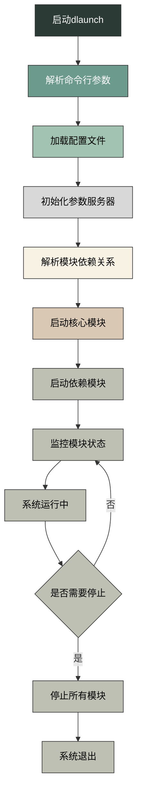
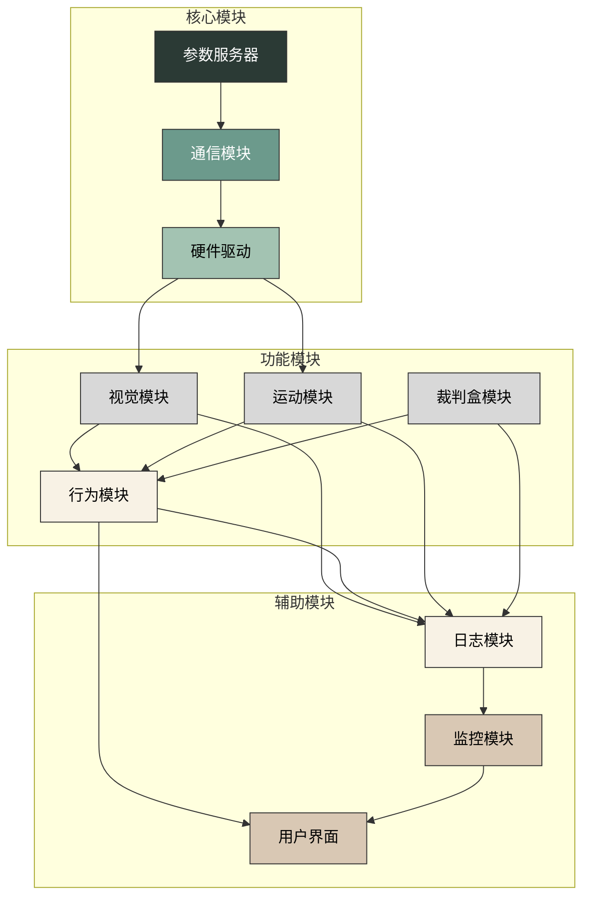
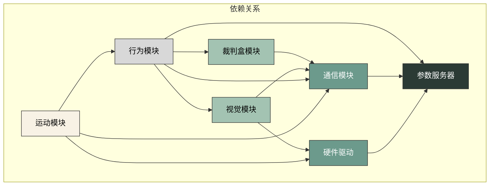
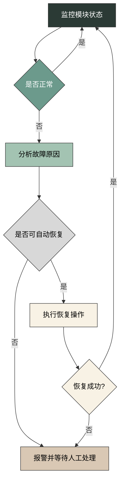

***

# Launch module

## Overview

`dlaunch` 是机器人系统的启动模块，负责系统的初始化、配置和启动流程管理。其主要由以下组件组成：

*   `config`: 配置文件管理，包括参数解析和加载
*   `launcher`: 启动器核心，负责启动各个模块
*   `manager`: 模块管理器，监控模块运行状态
*   `util`: 工具函数和辅助类

整个启动模块的运转流程如下：

1. 初始化，读取配置文件和参数
2. 解析命令行参数和配置文件
3. 根据配置启动各个模块（如视觉、行为、运动等）
4. 监控各个模块的运行状态
5. 处理模块间的通信和依赖关系
6. 提供系统级别的控制和管理功能

## 核心组件

### Config

config 组件主要负责配置文件的管理和参数解析，确保系统能够正确加载和使用配置信息。

*   `ConfigLoader`: 负责加载和解析配置文件，支持 YAML 和 JSON 格式
*   `ParameterServer`: 管理系统参数，提供参数访问接口，支持参数动态更新
*   `ConfigValidator`: 验证配置的有效性和完整性，确保配置符合系统要求

### Launcher

launcher 组件是启动模块的核心，负责启动和管理各个功能模块。

*   `ModuleLauncher`: 负责启动单个模块，处理模块的生命周期管理
*   `SystemLauncher`: 负责启动整个系统，协调各个模块的启动顺序
*   `LaunchController`: 控制启动流程和顺序，确保模块按照正确的依赖关系启动

### Manager

manager 组件负责监控和管理各个模块的运行状态，确保系统的稳定运行。

*   `ModuleManager`: 管理模块的生命周期，包括模块的注册、启动、停止和注销
*   `StatusMonitor`: 监控模块运行状态，及时发现和报告异常
*   `DependencyResolver`: 解决模块间的依赖关系，确保模块按照正确的顺序启动

### Util

util 组件提供各种工具函数和辅助类，支持启动模块的各项功能。

*   `Logger`: 日志工具，记录系统运行状态和错误信息
*   `ProcessManager`: 进程管理工具，负责启动和管理子进程
*   `NetworkUtils`: 网络工具，处理网络连接和通信
*   `FileUtils`: 文件工具，处理文件操作和路径管理

## 启动流程

## 模块启动顺序

## 配置文件结构

```mermaid
graph LR
    classDef L1 fill:#2B3A35,color:#fff,stroke:#333,stroke-width:1px;
    classDef L2 fill:#6C9A8C,color:#fff,stroke:#333,stroke-width:1px;
    classDef L3 fill:#A3C3B2,color:#000,stroke:#333,stroke-width:1px;

    subgraph 配置文件结构
        root[根配置]
        modules[模块配置]
        common[通用配置]
        network[网络配置]
        hardware[硬件配置]
        safety[安全配置]
        
        root --> modules
        root --> common
        root --> network
        root --> hardware
        root --> safety
        
        modules --> vision[视觉模块配置]
        modules --> behavior[行为模块配置]
        modules --> motion[运动模块配置]
        modules --> referee[裁判盒模块配置]
        modules --> ui[用户界面配置]
        
        common --> log[日志配置]
        common --> system[系统配置]
        common --> performance[性能配置]
        
        network --> ros[ROS配置]
        network --> wifi[WiFi配置]
        network --> ethernet[以太网配置]
        
        hardware --> camera[相机配置]
        hardware --> imu[IMU配置]
        hardware --> motor[电机配置]
        hardware --> battery[电池配置]
        
        safety --> emergency[紧急停止配置]
        safety --> collision[碰撞 avoidance配置]
        safety --> thermal[温度监控配置]
    end

    class root L1;
    class modules,common,network,hardware,safety L2;
    class vision,behavior,motion,referee,ui,log,system,performance,ros,wifi,ethernet,camera,imu,motor,battery,emergency,collision,thermal L3;
```

## 核心类关系

```mermaid
graph TD
    classDef L1 fill:#2B3A35,color:#fff,stroke:#333,stroke-width:1px;
    classDef L2 fill:#6C9A8C,color:#fff,stroke:#333,stroke-width:1px;
    classDef L3 fill:#A3C3B2,color:#000,stroke:#333,stroke-width:1px;
    classDef L4 fill:#D8D8D8,color:#000,stroke:#333,stroke-width:1px;

    LaunchModule --> Config
    LaunchModule --> Launcher
    LaunchModule --> Manager
    LaunchModule --> Util

    Config --> ConfigLoader
    Config --> ParameterServer
    Config --> ConfigValidator

    Launcher --> ModuleLauncher
    Launcher --> SystemLauncher
    Launcher --> LaunchController

    Manager --> ModuleManager
    Manager --> StatusMonitor
    Manager --> DependencyResolver

    Util --> Logger
    Util --> ProcessManager
    Util --> NetworkUtils
    Util --> FileUtils

    class LaunchModule L1;
    class Config,Launcher,Manager,Util L2;
    class ConfigLoader,ParameterServer,ConfigValidator,ModuleLauncher,SystemLauncher,LaunchController,ModuleManager,StatusMonitor,DependencyResolver L3;
    class Logger,ProcessManager,NetworkUtils,FileUtils L4;
```

## 模块间依赖关系

## 故障检测与恢复

## 日志系统

### 日志级别

1. **DEBUG**：详细的调试信息，用于开发和调试
2. **INFO**：一般的信息，用于记录系统的正常运行状态
3. **WARN**：警告信息，用于记录潜在的问题
4. **ERROR**：错误信息，用于记录系统错误
5. **FATAL**：致命错误信息，用于记录导致系统崩溃的错误