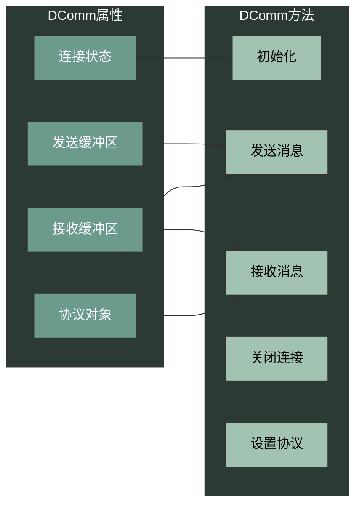
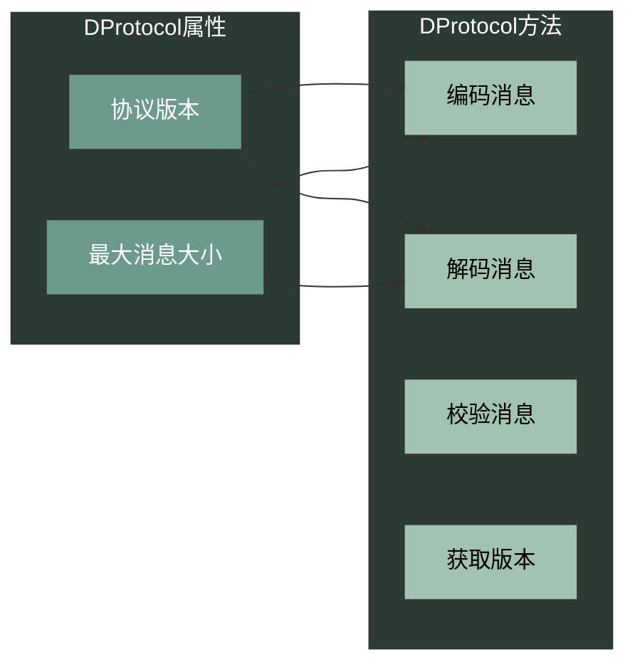
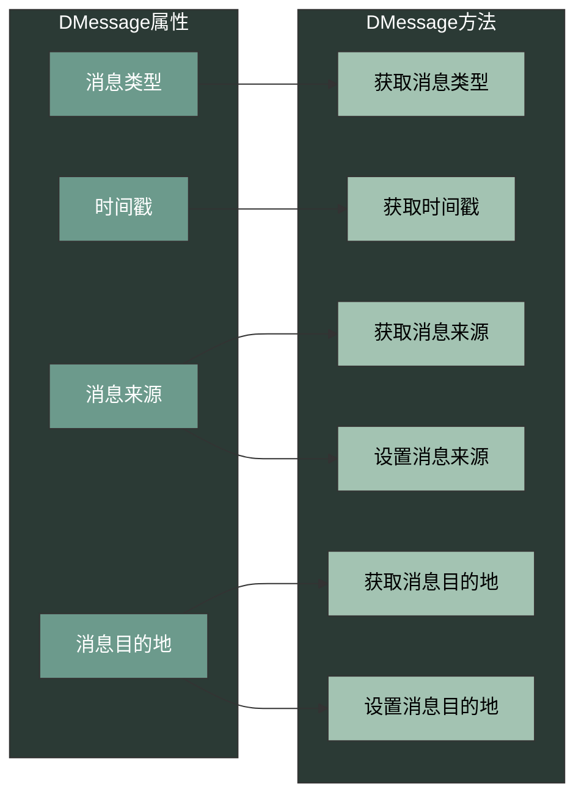
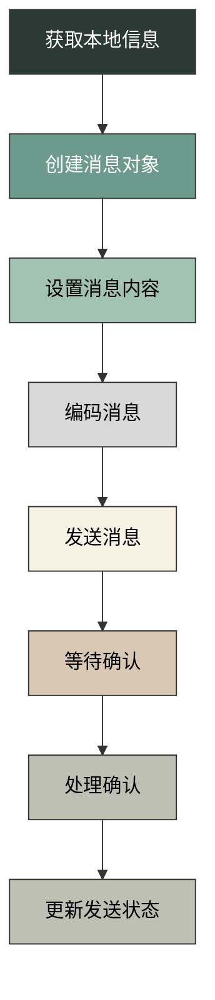
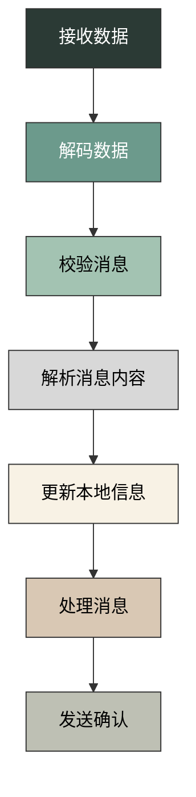
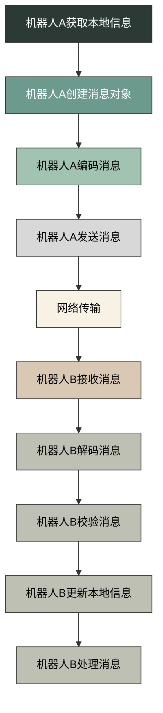

***

# Network module

## Overview

`dancer-network` 是机器人系统的网络通信模块，负责机器人与外部系统之间的信息交换。该模块支持多种通信方式，包括 UDP、TCP 和 ROS 话题，确保机器人能够与队友、上位机以及裁判系统进行实时、可靠的通信。

模块主要由以下组件组成：

*   `comm`: 通信核心，负责建立和维护网络连接，处理数据的发送和接收
*   `protocol`: 通信协议，定义数据传输的格式和规则，确保数据的一致性和可靠性
*   `message`: 消息结构，定义各种通信消息的格式，包括机器人状态、球的位置、场地信息等
*   `util`: 实用工具，提供消息序列化、网络工具等辅助功能

网络模块的典型运行流程如下：

0. 初始化阶段：读取配置参数，建立网络连接，初始化各组件
1. 信息采集：订阅来自其他模块的信息，如视觉、行为等模块的输出
2. 数据发送：将本地信息打包成消息，通过网络发送给其他机器人或上位机
3. 数据接收：接收来自其他机器人或上位机的消息，解析并更新到本地模块
4. 循环执行：一个运行周期结束后，重复步骤 1-4

## 核心组件详解

### Comm 组件

comm 组件是网络模块的核心，负责建立和维护网络连接，处理数据的发送和接收。该组件支持多种通信协议，适应不同的网络环境和通信需求。

#### DComm

`DComm` 是通信的基类，定义了通信的基本接口。所有具体的通信实现都继承自这个基类，确保了接口的一致性。

**主要属性**：
- `connectionState`: 连接状态，标识通信是否正常
- `sendBuffer`: 发送缓冲区，用于存储待发送的数据
- `receiveBuffer`: 接收缓冲区，用于存储接收到的数据
- `protocol`: 协议对象，用于消息的编码和解码

**主要方法**：
- `init()`: 初始化通信，设置相关参数
- `send(DMessage* msg, const std::string& address, int port)`: 发送消息到指定地址和端口
- `receive()`: 接收来自其他节点的消息
- `close()`: 关闭通信连接
- `setProtocol(DProtocol* protocol)`: 设置通信协议

#### DCommUDP

`DCommUDP` 是基于 UDP 协议的通信实现，适用于实时性要求高、允许少量数据丢失的场景，如机器人间的状态同步。

**主要属性**：
- `socket`: UDP 套接字
- `port`: 本地端口
- `broadcastEnabled`: 是否启用广播

**主要方法**：
- `init(int port, bool broadcast = false)`: 初始化 UDP 通信，设置端口和广播选项
- `send(DMessage* msg, const std::string& address, int port)`: 发送消息到指定地址和端口
- `receive()`: 接收来自其他节点的消息
- `close()`: 关闭 UDP 连接
- `setBroadcast(bool enabled)`: 设置是否启用广播

#### DCommTCP

`DCommTCP` 是基于 TCP 协议的通信实现，适用于可靠性要求高、数据完整性要求高的场景，如上位机与机器人之间的通信。

**主要属性**：
- `socket`: TCP 套接字
- `serverSocket`: 服务器套接字（用于服务器模式）
- `port`: 本地端口
- `isServer`: 是否为服务器模式

**主要方法**：
- `init(int port, bool server = false)`: 初始化 TCP 通信，设置端口和模式
- `connect(const std::string& address, int port)`: 连接到指定地址和端口
- `accept()`: 接受客户端连接（服务器模式）
- `send(DMessage* msg)`: 发送消息到已连接的节点
- `receive()`: 接收来自已连接节点的消息
- `close()`: 关闭 TCP 连接

#### DCommROS

`DCommROS` 是基于 ROS 话题的通信实现，适用于 ROS 环境下的模块间通信。

**主要属性**：
- `nh`: ROS 节点句柄
- `publishers`: 发布者列表
- `subscribers`: 订阅者列表

**主要方法**：
- `init(ros::NodeHandle& nh)`: 初始化 ROS 通信
- `advertise(const std::string& topic)`:  advertise 一个话题
- `subscribe(const std::string& topic, std::function<void(const std::string&)>)`: 订阅一个话题，支持函数指针和 lambda 表达式
- `publish(const std::string& topic, DMessage* msg)`: 发布消息到指定话题
- `close()`: 关闭 ROS 通信

### Protocol 组件

protocol 组件定义了通信协议，确保数据传输的一致性和可靠性。不同的协议实现适用于不同的场景和需求。

#### DProtocol

`DProtocol` 是协议的基类，定义了协议的基本接口。所有具体的协议实现都继承自这个基类。

**主要属性**：
- `version`: 协议版本
- `maxMessageSize`: 最大消息大小

**主要方法**：
- `encode(DMessage* msg, std::vector<uint8_t>& buffer)`: 将消息编码为二进制格式
- `decode(const std::vector<uint8_t>& buffer, DMessage*& msg)`: 将二进制数据解码为消息对象
- `checksum(const std::vector<uint8_t>& buffer)`: 计算消息的校验和
- `getVersion()`: 获取协议版本

#### DProtocolBinary

`DProtocolBinary` 是二进制协议实现，具有高效、紧凑的特点，适用于带宽有限的场景。

**主要属性**：
- `headerSize`: 消息头大小
- `crcSize`: 校验和大小

**主要方法**：
- `encode(DMessage* msg, std::vector<uint8_t>& buffer)`: 将消息编码为二进制格式，包括消息头、消息体和校验和
- `decode(const std::vector<uint8_t>& buffer, DMessage*& msg)`: 将二进制数据解码为消息对象，验证校验和
- `checksum(const std::vector<uint8_t>& buffer)`: 计算消息的 CRC32 校验和

#### DProtocolJSON

`DProtocolJSON` 是 JSON 协议实现，具有可读性强、易于调试的特点，适用于开发和调试阶段。

**主要属性**：
- `prettyPrint`: 是否美化 JSON 输出

**主要方法**：
- `encode(DMessage* msg, std::vector<uint8_t>& buffer)`: 将消息编码为 JSON 格式
- `decode(const std::vector<uint8_t>& buffer, DMessage*& msg)`: 将 JSON 数据解码为消息对象
- `checksum(const std::vector<uint8_t>& buffer)`: 计算消息的校验和（简单实现）
- `setPrettyPrint(bool pretty)`: 设置是否美化 JSON 输出

### Message 组件

message 组件定义了各种通信消息的格式，包括机器人状态、球的位置、场地信息等。消息是数据传输的基本单位，确保了数据的结构化和一致性。

#### DMessage

`DMessage` 是消息的基类，定义了消息的基本结构。所有具体的消息类型都继承自这个基类。

**主要属性**：
- `type`: 消息类型
- `timestamp`: 时间戳
- `source`: 消息来源
- `destination`: 消息目的地

**主要方法**：
- `getType()`: 获取消息类型
- `getTimestamp()`: 获取时间戳
- `getSource()`: 获取消息来源
- `getDestination()`: 获取消息目的地
- `setSource(const std::string& source)`: 设置消息来源
- `setDestination(const std::string& destination)`: 设置消息目的地

#### DMessageRobotState

`DMessageRobotState` 是机器人状态消息，用于传输机器人的状态信息。

**主要属性**：
- `x`: x 坐标
- `y`: y 坐标
- `theta`: 朝向角
- `vx`: x 方向速度
- `vy`: y 方向速度
- `vtheta`: 角速度
- `battery`: 电池电压
- `role`: 机器人角色
- `status`: 机器人状态

**主要方法**：
- `setPose(double x, double y, double theta)`: 设置机器人的位置和姿态
- `getPose(double& x, double& y, double& theta)`: 获取机器人的位置和姿态
- `setVelocity(double vx, double vy, double vtheta)`: 设置机器人的速度
- `getVelocity(double& vx, double& vy, double& vtheta)`: 获取机器人的速度
- `setBattery(double battery)`: 设置电池状态
- `getBattery()`: 获取电池状态
- `setRole(const std::string& role)`: 设置机器人的角色
- `getRole()`: 获取机器人的角色
- `setStatus(const std::string& status)`: 设置机器人状态
- `getStatus()`: 获取机器人状态

#### DMessageBallInfo

`DMessageBallInfo` 是球信息消息，用于传输球的位置和状态信息。

**主要属性**：
- `x`: x 坐标
- `y`: y 坐标
- `vx`: x 方向速度
- `vy`: y 方向速度
- `confidence`: 置信度
- `seen`: 是否被看到

**主要方法**：
- `setPosition(double x, double y)`: 设置球的位置
- `getPosition(double& x, double& y)`: 获取球的位置
- `setVelocity(double vx, double vy)`: 设置球的速度
- `getVelocity(double& vx, double& vy)`: 获取球的速度
- `setConfidence(double confidence)`: 设置置信度
- `getConfidence()`: 获取置信度
- `setSeen(bool isSeen)`: 设置是否被看到
- `isSeen()`: 获取是否被看到

#### DMessageFieldInfo

`DMessageFieldInfo` 是场地信息消息，用于传输场地的相关信息。

**主要属性**：
- `fieldPoints`: 场地特征点
- `goalPosts`: 球门柱位置
- `centerCircle`: 中心圆位置

**主要方法**：
- `addFieldPoint(const FieldPoint& point)`: 添加场地特征点
- `getFieldPoints(std::vector<FieldPoint>& points)`: 获取场地特征点
- `setGoalPosts(const GoalPost& left, const GoalPost& right)`: 设置球门柱位置
- `getGoalPosts(GoalPost& left, GoalPost& right)`: 获取球门柱位置
- `setCenterCircle(const Circle& circle)`: 设置中心圆位置
- `getCenterCircle(Circle& circle)`: 获取中心圆位置

#### DMessageGameState

`DMessageGameState` 是比赛状态消息，用于传输比赛的状态信息。

**主要属性**：
- `gameState`: 比赛状态
- `phase`: 比赛阶段
- `score`: 比分
- `timeRemaining`: 剩余时间

**主要方法**：
- `setGameState(const std::string& state)`: 设置比赛状态
- `getGameState()`: 获取比赛状态
- `setPhase(const std::string& phase)`: 设置比赛阶段
- `getPhase()`: 获取比赛阶段
- `setScore(int ourScore, int theirScore)`: 设置比分
- `getScore(int& ourScore, int& theirScore)`: 获取比分
- `setTimeRemaining(int seconds)`: 设置剩余时间
- `getTimeRemaining()`: 获取剩余时间

### Util 组件

util 组件提供了各种辅助功能，如消息序列化、网络工具等，为网络模块的其他组件提供支持。

#### DSerializer

`DSerializer` 是消息序列化工具，用于将消息对象转换为二进制数据，以及将二进制数据转换为消息对象。

**主要方法**：
- `serialize(DMessage* msg, std::vector<uint8_t>& buffer)`: 将消息对象序列化为二进制数据
- `deserialize(const std::vector<uint8_t>& buffer, DMessage*& msg)`: 将二进制数据反序列化为消息对象

#### DNetworkUtil

`DNetworkUtil` 是网络工具类，提供了各种网络相关的辅助功能。

**主要方法**：
- `getLocalIP()`: 获取本地 IP 地址
- `getBroadcastIP()`: 获取广播 IP 地址
- `checkPort(int port)`: 检查端口是否可用
- `resolveHostname(const std::string& hostname, std::string& ip)`: 将主机名解析为 IP 地址

## 代码结构

### 类的继承关系

```mermaid
graph TD
    classDef L1 fill:#2B3A35,color:#fff,stroke:#333,stroke-width:1px;
    classDef L2 fill:#6C9A8C,color:#fff,stroke:#333,stroke-width:1px;
    classDef L3 fill:#A3C3B2,color:#000,stroke:#333,stroke-width:1px;
    classDef L4 fill:#D8D8D8,color:#000,stroke:#333,stroke-width:1px;
    classDef L5 fill:#F8F2E5,color:#000,stroke:#333,stroke-width:1px;
    classDef L6 fill:#D9C8B4,color:#000,stroke:#333,stroke-width:1px;
    classDef L7 fill:#BEC0B4,color:#000,stroke:#333,stroke-width:1px;

    DComm --> DCommUDP
    DComm --> DCommTCP
    DComm --> DCommROS
    
    DProtocol --> DProtocolBinary
    DProtocol --> DProtocolJSON
    
    DMessage --> DMessageRobotState
    DMessage --> DMessageBallInfo
    DMessage --> DMessageFieldInfo
    DMessage --> DMessageGameState
    
    DSerializer --> DSerializerBinary
    DSerializer --> DSerializerJSON

    class DComm,DProtocol,DMessage,DSerializer L1;
    class DCommUDP,DCommTCP,DCommROS,DProtocolBinary,DProtocolJSON,DMessageRobotState,DMessageBallInfo,DMessageFieldInfo,DMessageGameState,DSerializerBinary,DSerializerJSON L2;
```



### 核心类详解

#### DComm (dcomm.hpp)



#### DProtocol (dprotocol.hpp)



#### DMessage (dmessage.hpp)



## 主要功能详解

### 机器人间通信

机器人间通信是团队协作的基础，通过网络交换信息，实现团队的协调配合。

#### 数据交换

*   **状态信息**: 机器人之间交换位置、速度、姿态等状态信息，确保团队成员了解彼此的情况
*   **球信息**: 共享球的位置、速度等信息，确保团队成员能够快速定位球的位置
*   **场地信息**: 交换场地特征点、球门位置等信息，辅助定位和导航
*   **决策信息**: 共享战术决策，如进攻方向、防守策略等

#### 协作决策

*   **角色分配**: 根据场上情况，动态调整机器人的角色，如前锋、后卫、守门员等
*   **任务分配**: 根据机器人的位置和状态，分配具体任务，如追球、盯人、防守等
*   **战术执行**: 协调执行战术，如传球、掩护、夹击等

#### 同步机制

*   **时间同步**: 确保机器人之间的时间同步，避免因时间差异导致的协调问题
*   **状态同步**: 确保团队成员的状态信息保持同步，避免信息不一致导致的冲突
*   **决策同步**: 确保团队成员的决策保持一致，避免战术执行的混乱

### 与上位机通信

与上位机的通信主要用于监控、控制和数据记录，是开发和调试的重要手段。

#### 状态监控

*   **实时状态**: 向上位机发送机器人的实时状态，如位置、速度、电池电压等
*   **传感器数据**: 发送传感器数据，如摄像头图像、激光雷达数据等
*   **系统状态**: 发送系统状态，如 CPU 使用率、内存使用情况等

#### 远程控制

*   **手动操作**: 接收上位机的手动控制指令，如移动、踢球等
*   **参数调整**: 接收上位机的参数调整指令，如 PID 参数、行为树参数等
*   **模式切换**: 接收上位机的模式切换指令，如自主模式、手动模式等

#### 数据记录

*   **比赛数据**: 向上位机传输比赛数据，如进球数、传球次数等
*   **日志数据**: 传输系统日志，用于分析和调试
*   **性能数据**: 传输性能数据，如响应时间、处理帧率等

### 与裁判系统通信

与裁判系统的通信是比赛规则的要求，确保机器人能够正确响应裁判指令。

#### 接收裁判指令

*   **比赛状态**: 接收裁判盒发送的比赛状态，如准备、开始、暂停、结束等
*   **处罚信息**: 接收裁判盒发送的处罚信息，如黄牌、红牌等
*   **比赛阶段**: 接收裁判盒发送的比赛阶段，如上半场、下半场、加时赛等

#### 发送机器人状态

*   **准备状态**: 向裁判系统发送机器人的准备状态，如是否就绪
*   **故障状态**: 向裁判系统发送机器人的故障状态，如是否需要暂停
*   **合规状态**: 向裁判系统发送机器人的合规状态，如是否符合比赛规则

## 关键方法详解

### DCommUDP

#### init(int port, bool broadcast = false)

**功能**: 初始化 UDP 通信，设置端口和广播选项

**参数**:
- `port`: 本地端口号
- `broadcast`: 是否启用广播

**实现细节**:
1. 创建 UDP 套接字
2. 设置套接字选项，如重用地址、广播等
3. 绑定到指定端口
4. 初始化发送和接收缓冲区

#### send(DMessage* msg, const std::string& address, int port)

**功能**: 发送消息到指定地址和端口

**参数**:
- `msg`: 要发送的消息
- `address`: 目标地址
- `port`: 目标端口

**实现细节**:
1. 使用协议对象将消息编码为二进制数据
2. 将二进制数据发送到指定地址和端口
3. 记录发送状态和统计信息

#### receive()

**功能**: 接收来自其他节点的消息

**返回值**: 接收到的消息对象，若没有接收到消息则返回 nullptr

**实现细节**:
1. 从套接字接收数据到接收缓冲区
2. 使用协议对象将二进制数据解码为消息对象
3. 验证消息的完整性和有效性
4. 返回解码后的消息对象

### DProtocolBinary

#### encode(DMessage* msg, std::vector<uint8_t>& buffer)

**功能**: 将消息编码为二进制格式

**参数**:
- `msg`: 要编码的消息
- `buffer`: 存储编码结果的缓冲区

**实现细节**:
1. 写入消息头，包括消息类型、长度等
2. 写入消息体，包括消息的各个字段
3. 计算并写入校验和
4. 设置缓冲区大小和内容

#### decode(const std::vector<uint8_t>& buffer, DMessage*& msg)

**功能**: 将二进制数据解码为消息对象

**参数**:
- `buffer`: 要解码的二进制数据
- `msg`: 存储解码结果的消息对象

**实现细节**:
1. 验证消息头的有效性
2. 计算并验证校验和
3. 根据消息类型创建对应的消息对象
4. 从二进制数据中提取各个字段的值
5. 设置消息对象的各个属性

#### checksum(const std::vector<uint8_t>& buffer)

**功能**: 计算消息的校验和，确保数据完整性

**参数**:
- `buffer`: 要计算校验和的数据

**返回值**: 计算得到的校验和

**实现细节**:
1. 使用 CRC32 算法计算校验和
2. 返回计算结果

### DMessageRobotState

#### setPose(double x, double y, double theta)

**功能**: 设置机器人的位置和姿态

**参数**:
- `x`: x 坐标
- `y`: y 坐标
- `theta`: 朝向角

**实现细节**:
1. 验证参数的有效性
2. 设置位置和姿态属性
3. 更新时间戳

#### setVelocity(double vx, double vy, double vtheta)

**功能**: 设置机器人的速度

**参数**:
- `vx`: x 方向速度
- `vy`: y 方向速度
- `vtheta`: 角速度

**实现细节**:
1. 验证参数的有效性
2. 设置速度属性
3. 更新时间戳

#### setBattery(double battery)

**功能**: 设置电池状态

**参数**:
- `battery`: 电池电压

**实现细节**:
1. 验证参数的有效性
2. 设置电池属性
3. 更新时间戳

#### setRole(const std::string& role)

**功能**: 设置机器人的角色

**参数**:
- `role`: 机器人角色

**实现细节**:
1. 验证参数的有效性
2. 设置角色属性
3. 更新时间戳

## 工作流程详解

### 发送消息流程



**详细步骤**:
1. **获取本地信息**: 从其他模块获取需要发送的信息，如机器人状态、球的位置等
2. **创建消息对象**: 根据信息类型创建对应的消息对象，如 DMessageRobotState、DMessageBallInfo 等
3. **设置消息内容**: 将获取的信息填充到消息对象中
4. **编码消息**: 使用协议对象将消息编码为二进制格式
5. **发送消息**: 通过通信对象将编码后的消息发送到目标地址
6. **等待确认**: 等待接收方的确认消息（如果需要）
7. **处理确认**: 处理接收到的确认消息
8. **更新发送状态**: 更新发送状态和统计信息

### 接收消息流程



**详细步骤**:
1. **接收数据**: 从通信对象接收二进制数据
2. **解码数据**: 使用协议对象将二进制数据解码为消息对象
3. **校验消息**: 验证消息的完整性和有效性
4. **解析消息内容**: 从消息对象中提取各个字段的值
5. **更新本地信息**: 将提取的信息更新到本地模块
6. **处理消息**: 根据消息类型执行相应的处理逻辑
7. **发送确认**: 向发送方发送确认消息（如果需要）

### 机器人间通信流程



**详细步骤**:
1. **机器人A获取本地信息**: 机器人A从自身的传感器和模块获取信息
2. **机器人A创建消息对象**: 机器人A根据信息类型创建消息对象
3. **机器人A编码消息**: 机器人A使用协议将消息编码为二进制格式
4. **机器人A发送消息**: 机器人A通过网络发送消息
5. **网络传输**: 消息通过网络传输到机器人B
6. **机器人B接收消息**: 机器人B接收网络传来的消息
7. **机器人B解码消息**: 机器人B使用协议将二进制数据解码为消息对象
8. **机器人B校验消息**: 机器人B验证消息的完整性和有效性
9. **机器人B更新本地信息**: 机器人B将消息中的信息更新到本地
10. **机器人B处理消息**: 机器人B根据消息内容执行相应的处理逻辑

## 常见问题与解决方案

### 网络连接问题

#### 无法建立网络连接

**问题描述**: 机器人无法与其他节点建立网络连接，可能是由于网络配置错误、防火墙阻挡或硬件故障等原因。

**解决方案**:
- 检查网络配置，确保 IP 地址和端口设置正确
- 检查防火墙设置，确保相关端口已开放
- 检查网络硬件，如网线、路由器等是否正常工作
- 尝试使用不同的网络协议，如 UDP 或 TCP
- 检查网络拓扑，确保网络路径畅通

#### 连接不稳定，经常断开

**问题描述**: 网络连接不稳定，经常断开，可能是由于网络信号强度弱、网络拥塞或硬件故障等原因。

**解决方案**:
- 检查网络信号强度，确保机器人在网络覆盖范围内
- 减少网络拥塞，如优化数据传输频率和数据量
- 检查网络硬件，如网线、路由器等是否正常工作
- 尝试使用更可靠的网络协议，如 TCP
- 实现连接重连机制，在连接断开后自动重新连接

### 数据传输问题

#### 数据传输延迟高

**问题描述**: 数据传输延迟高，影响实时性，可能是由于网络拥塞、数据量过大或编码效率低等原因。

**解决方案**:
- 优化网络拓扑，减少网络跳数
- 减少数据传输频率和数据量，只传输必要的信息
- 使用更高效的编码方式，如二进制编码
- 实现数据压缩，减少数据传输量
- 优先传输重要数据，确保关键信息的实时性

#### 数据丢失或损坏

**问题描述**: 数据传输过程中出现丢失或损坏，可能是由于网络不稳定、校验机制不完善或编码错误等原因。

**解决方案**:
- 实现数据重传机制，确保数据可靠传输
- 使用校验和或其他校验机制，确保数据完整性
- 优化编码和解码逻辑，减少编码错误
- 使用更可靠的网络协议，如 TCP
- 实现数据冗余，提高数据传输的可靠性

### 消息处理问题

#### 消息解析错误

**问题描述**: 消息解析错误，无法正确解码消息，可能是由于协议版本不匹配、消息格式错误或编码错误等原因。

**解决方案**:
- 确保发送方和接收方使用相同的协议版本
- 检查消息格式是否正确，确保符合协议规范
- 优化编码和解码逻辑，减少编码错误
- 实现消息验证机制，拒绝无效消息
- 增加错误处理，提高系统的鲁棒性

#### 消息处理延迟

**问题描述**: 消息处理延迟高，影响系统响应速度，可能是由于处理逻辑复杂、CPU 负载高或消息队列过长等原因。

**解决方案**:
- 优化消息处理逻辑，减少处理时间
- 使用多线程处理消息，提高并发处理能力
- 实现消息队列，缓冲消息，避免处理瓶颈
- 优化系统资源分配，确保消息处理有足够的 CPU 和内存资源
- 优先级处理重要消息，确保关键信息的及时处理

### 其他问题

#### 网络安全问题

**问题描述**: 网络通信存在安全隐患，可能被恶意攻击或干扰。

**解决方案**:
- 实现消息加密，确保数据传输的安全性
- 使用身份验证机制，确保只有授权节点能够通信
- 实现访问控制，限制网络访问权限
- 监测网络异常，及时发现和处理安全威胁
- 定期更新安全策略，适应新的安全挑战

#### 性能问题

**问题描述**: 网络模块性能不足，无法满足实时性要求，可能是由于代码效率低、资源分配不合理或硬件限制等原因。

**解决方案**:
- 优化代码，提高执行效率
- 合理分配系统资源，确保网络模块有足够的资源
- 使用更高效的算法和数据结构
- 考虑使用硬件加速，如网卡卸载
- 定期性能测试和优化，持续改进系统性能

## 代码示例

### 初始化网络通信

```cpp
// 创建 UDP 通信对象
DCommUDP comm;
// 初始化通信，设置端口为 8888，启用广播
comm.init(8888, true);

// 创建二进制协议对象
DProtocolBinary protocol;
// 设置协议
comm.setProtocol(&protocol);

// 打印初始化信息
std::cout << "UDP communication initialized on port 8888" << std::endl;
```

### 发送机器人状态消息

```cpp
// 创建机器人状态消息
DMessageRobotState msg;

// 设置消息来源和目的地
msg.setSource("robot1");
msg.setDestination("team");

// 设置机器人位置和姿态
msg.setPose(1.0, 2.0, 0.5);

// 设置机器人速度
msg.setVelocity(0.5, 0.0, 0.1);

// 设置电池状态
msg.setBattery(12.5);

// 设置机器人角色
msg.setRole("striker");

// 设置机器人状态
msg.setStatus("active");

// 发送消息到广播地址
comm.send(&msg, "255.255.255.255", 8888);

// 打印发送信息
std::cout << "Robot state message sent" << std::endl;
```

### 接收消息

```cpp
// 循环接收消息
while (true) {
    // 接收消息
    DMessage* msg = comm.receive();
    if (msg != nullptr) {
        // 根据消息类型处理
        switch (msg->getType()) {
            case DMessage::ROBOT_STATE:
            {
                DMessageRobotState* robotStateMsg = static_cast<DMessageRobotState*>(msg);
                // 获取机器人位置
                double x, y, theta;
                robotStateMsg->getPose(x, y, theta);
                // 获取机器人速度
                double vx, vy, vtheta;
                robotStateMsg->getVelocity(vx, vy, vtheta);
                // 获取电池状态
                double battery = robotStateMsg->getBattery();
                // 获取机器人角色
                std::string role = robotStateMsg->getRole();
                // 打印机器人状态
                std::cout << "Received robot state: " << std::endl;
                std::cout << "  Position: (" << x << ", " << y << ", " << theta << ")" << std::endl;
                std::cout << "  Velocity: (" << vx << ", " << vy << ", " << vtheta << ")" << std::endl;
                std::cout << "  Battery: " << battery << "V" << std::endl;
                std::cout << "  Role: " << role << std::endl;
                break;
            }
            case DMessage::BALL_INFO:
            {
                DMessageBallInfo* ballInfoMsg = static_cast<DMessageBallInfo*>(msg);
                // 获取球的位置
                double x, y;
                ballInfoMsg->getPosition(x, y);
                // 获取球的速度
                double vx, vy;
                ballInfoMsg->getVelocity(vx, vy);
                // 获取置信度
                double confidence = ballInfoMsg->getConfidence();
                // 获取是否被看到
                bool isSeen = ballInfoMsg->isSeen();
                // 打印球信息
                std::cout << "Received ball info: " << std::endl;
                std::cout << "  Position: (" << x << ", " << y << ")" << std::endl;
                std::cout << "  Velocity: (" << vx << ", " << vy << ")" << std::endl;
                std::cout << "  Confidence: " << confidence << std::endl;
                std::cout << "  Is seen: " << (isSeen ? "yes" : "no") << std::endl;
                break;
            }
            case DMessage::GAME_STATE:
            {
                DMessageGameState* gameStateMsg = static_cast<DMessageGameState*>(msg);
                // 获取比赛状态
                std::string gameState = gameStateMsg->getGameState();
                // 获取比赛阶段
                std::string phase = gameStateMsg->getPhase();
                // 获取比分
                int ourScore, theirScore;
                gameStateMsg->getScore(ourScore, theirScore);
                // 获取剩余时间
                int timeRemaining = gameStateMsg->getTimeRemaining();
                // 打印比赛状态
                std::cout << "Received game state: " << std::endl;
                std::cout << "  Game state: " << gameState << std::endl;
                std::cout << "  Phase: " << phase << std::endl;
                std::cout << "  Score: " << ourScore << " - " << theirScore << std::endl;
                std::cout << "  Time remaining: " << timeRemaining << " seconds" << std::endl;
                break;
            }
            default:
                std::cout << "Received unknown message type" << std::endl;
                break;
        }
        // 释放消息内存
        delete msg;
    }
    // 短暂休眠，避免占用过多 CPU
        std::this_thread::sleep_for(std::chrono::milliseconds(1));
}
```

### 使用 TCP 通信

```cpp
// 创建 TCP 通信对象（服务器模式）
DCommTCP server;
// 初始化服务器，设置端口为 9999
server.init(9999, true);

// 等待客户端连接
std::cout << "Waiting for client connection..." << std::endl;
DCommTCP* client = server.accept();
if (client != nullptr) {
    std::cout << "Client connected" << std::endl;
    
    // 发送消息
    DMessageRobotState msg;
    msg.setPose(0.0, 0.0, 0.0);
    client->send(&msg);
    
    // 接收消息
    DMessage* receivedMsg = client->receive();
    if (receivedMsg != nullptr) {
        // 处理消息
        std::cout << "Received message from client" << std::endl;
        delete receivedMsg;
    }
    
    // 关闭客户端连接
    client->close();
    delete client;
}

// 关闭服务器
server.close();
```

### 使用 ROS 通信

```cpp
// 初始化 ROS 节点
ros::init(argc, argv, "network_node");
ros::NodeHandle nh;

// 创建 ROS 通信对象
DCommROS comm;
// 初始化 ROS 通信
comm.init(nh);

//  advertise 话题
comm.advertise("robot_state");

// 订阅话题
comm.subscribe("ball_info", [](const std::string& msg) {
    std::cout << "Received ball info: " << msg << std::endl;
});

// 发送消息
DMessageRobotState robotStateMsg;
robotStateMsg.setPose(1.0, 2.0, 0.5);
comm.publish("robot_state", &robotStateMsg);

// 循环处理 ROS 消息
ros::spin();

// 关闭 ROS 通信
comm.close();
```