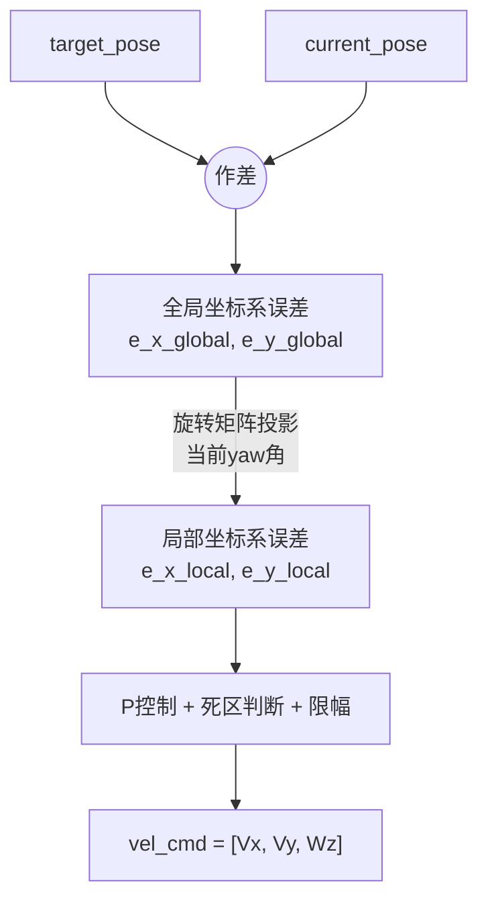

---

# Planner Module

先明确这些变量的意义：

代码块
```cpp
bool see_ball= false;
vector<double> ball_field = {1,0,0}; // 球在机器人坐标系下的位置
vector<double> ball_global = {0,0,0}; // 球在全局坐标系下的位置
vector<double> ball_velocity = {0,0,0}; // 球在机器人坐标系下的速度
vector<double> robot_global = {0,0,0}; // 机器人全局坐标系下的位置
vector<double> action_global = {0,0,0}; // 目标点在全局坐标系下的位置
vector<double> vel_cmd = {0,0,0}; // 规划出来，用于发布的速度
std::vector<std::vector<double>> obstacles; // 障碍物信息，每个障碍物包含 x, y, radius，存储多个障碍物
int gait_type = 0; // 步态类型
int kick_type = 0; // 踢球类型
bool kick_flag = false; // 是否处于踢球准备阶段的标志
bool dribble_flag = false; // 是否处于盘球阶段的标志
double ball_field_distance; //球在机器人坐标系下的距离
double ball_field_angle; //球在机器人坐标系下的角度
double robot_angle_error = 0; // 朝向目标点 - 现在的朝向
```

### 先看主函数：

**1. 节点初始化与 ROS 通信配置 (Line 363 - 384)**
* **环境变量区分机器人**：通过读取环境变量 `ZJUDANCER_ROBOTID`，为话题 (Topic) 加上特定的前缀，从而在一台电脑或仿真环境中区分控制不同的机器人个体。
* 有个DWA的实例，但还没用上
* **发布与订阅 (Pub & Sub)**：
    * 订阅视觉信息 `VisionInfo`：获取机器人全局坐标、球的局部和全局坐标、球速等。
    * 订阅行为指令 `ActionCommand`：接收上层决策层下发的指令（包含目标坐标 `bodyCmd.x, y, t` 以及期望的步态类型 `gait_type`）。
    * 发布速度指令 `cmd_vel` (`geometry_msgs::Twist`)：发布计算后的平移和旋转速度控制底盘（全向移动底盘）。
    * 发布手柄指令 `/joy_msg`：通过模拟手柄行为来发送诸如“左脚踢球”、“右脚踢球”、“向左扑救”等特殊动作触发指令。

**2. 控制参数初始化 (Line 386 - 428)**
定义了一系列控制动作时使用的常量，包括：
* **速度与容差参数**：最大/最小线速度、角速度，到达目标点的容差。
* **盘球 (Dribble) 参数**：定义了找球、绕球调整朝向、前进带球这三个子阶段触发的距离和角度容差。
* **踢球 (Kick) 参数**：定义了踢球时的期望身位偏移。
* **扑救 (Goalie) 参数**：判定球在左侧还是右侧以决定扑救方向。

**3. 主事件循环 (状态机) (Line 429 - 736)**
不同的 `gait_type` 对应不同的行为：
* **case 0 (站立待命)**
    * 所有的速度指令清零。

* **case 1 (走到目标点 / Walk)**
    * 调用 `generate_velocity` 计算产生控制速度。
    * 当小车距离目标点的坐标误差小于 0.3 米且偏航角 (Yaw) 误差小于 0.2 弧度时，将速度清零并把状态切回等待态 (`gait_type = 0`)。

* **case 2 (走过去+踢球 / Walk & Kick)**
这部分是一个多段式的状态转移逻辑：
    * **找球与绕球阶段 (`kick_flag == false`)**：
        i. **接近球**：先判断机器人到球的距离是否大于阈值 `close_to_ball`，如果大于那么先靠近球，调用 `generate_velocity` 产生控制速度。
        ii. **面向球**：靠近后判断机器人与球的角度是否大于阈值 `dribble_face_ball_tolerance`，如果大于则基于纯角速度 `cmd_vel[2]` 旋转，面向足球。
        iii. **面向球门**：在面向球的情况下，判断机器人与球门的角度是否大于阈值 `dribble_face_goal_tolerance`，若大于则机器人会通过横移 (`cmd_vel[1]`) 配合补偿旋转，实现“围绕球作圆弧平移”动作，从而使机器人、球、球门共线。
        iv. 对准后，挂起标志位 `kick_flag = true`。
    * **踢球微调准备与击球阶段 (`kick_flag == true`)**：
        i. 使用之前决定的 `kick_type` 获取理想触球点参数 (`kick_param`)，计算球的期望和实际的位置和角度偏差。
        ii. 如果存在较小的微观位置偏差和角度偏差，则使用最小速度进行细微位置修正。（这里采用了一个小速度而注释掉了P控制，可能追求稳定性吧）
        iii. 当容差满足时 (`err_x, err_y, yaw_err < tol`)，发布触球指令：模拟发送 `joy_msg` 的不同按键指令，触发下位机或执行系统中不同脚法、不同侧向的踢球动作，踢球结束重置标志位。

* **case 3 (盘球/带球 / Dribble)**
    * 第一阶段与踢球一样：跑位、对准球、对准目标方向。
    * 处于对齐理想路径后，机器人仅仅给定一个恒定的直行前向速度 (`MIN_LINEAR_SPEED * 3`)，笔直地把球沿目标方向推走。

* **case 4 (原地转向 / Turn)**
    * 给定最大/最小角速度范围内的一个按比例衰减角速度系数，让机器人原地旋转到目标航向。完成后变为 `case 0` 状态。

* **case 5 (门将扑救 / Goalie)**
    * 先将移动速度设为零（守门员不乱跑）。
    * 评估传入的 `ball_velocity`，如果球处于几乎静止状态，不进行扑救。
    * 否则利用当前球场的相对Y坐标 (`last_y = parameters.stp.ball_field[1]`)，当球靠近左侧时模拟按下 `joy_msg.a = 1.0` （触发左扑动作），当球靠近右侧时按下 `joy_msg.b = 1.0` （触发右扑动作）。

**4. 发布结果并休眠循环 (Line 724 - 735)**
赋值计算好的结果至 `velocity_msg` 并向小车底层控制发布 `cmd_vel`；同时也向后发布可能存在按键操作的 `joy_msg`。进入下一轮判断周期。

---

### 再看调用函数

**1. double distanceToBallTargetLine () (Line 75 - 101)**
计算机器人到“球-目标点”直线的垂直距离。
A点(球)，B点(目标点)，P点(机器人)，分别调用全局坐标系下的坐标，计算出向量AB(球到目标点)和AP(球到机器人)，利用叉乘公式|AB x AP| / |AB|计算出点P到AB的距离，即机器人到“球-目标点”直线的垂直距离。

**2. void VisionCallBack(const dmsgs::VisionInfo::ConstPtr &msg) (Line 104 - 142)**
视觉信息回调
* **更新机器人全局位姿**：其中除以100是单位换算，下面同理，不再赘述
* **计算机器人的朝向误差**：通过机器人和目标点在全局坐标系下的坐标计算得出。
* **根据视觉信息更新布尔值 `see_ball`**
* **更新球的全局/局部坐标、速度**
* **更新球相对机器人的距离/角度**
* **重置踢球/盘球标志**：若球在机器人坐标系下的距离和角度满足条件，则机器人不进入踢球准备阶段和盘球阶段。

**3. void ActionCallBack (Line 152 - 161)**
动作指令回调（与上一个函数类似）
* 更新全局坐标系下目标位姿
* 更新步态类型：读取 `gait_type` 的信息
* 重新计算朝向误差

**4. void generate_velocity(const std::vector<double>& current_pose, const std::vector<double>& target_pose) (Line 180 - 266)**
速度规划函数
* **参数验证并提取**：确保位姿信息包含x, y, yaw三个元素。
* **参数设置**：源代码中注释十分清楚
* **计算全局坐标系中的误差向量并转换到局部坐标系下**
* **计算X和Y方向速度及角速度**：需要注意的是，这里面的速度为比例增益 `Kp` 和在X/Y方向上的机器人坐标系重点局部误差 `e_x/y_local` 乘积，同理角速度为YAW比例增益 `Kp_YAW` 和角度局部误差 `angle_error` 之积定义。
* **更新速度命令**

**整体数据流：**



**5. initJoyMsg (Line 268 - 298)**
遥控器消息初始化
~~`joy_msg.lt = 1.0` 为什么这么定义似乎是手册上面写的？~~

**6. double kick_cost(int kick_type) (Line 309 - 337)**
踢球代价计算，在主函数中调用决定踢球动作
* 先将X,Y,YAW三个方向的代价权重归一化
* 提取该踢球类型的期望参数并计算误差
* 计算代价

**7. int decide_kick_type() (Line 339 - 359)**
最优踢球类型选择
* 若当前踢球类型代价足够小，不切换
* 遍历所有踢球类型，找代价最小的
* 若最优类型与当前类型代价差距不大，保留当前类型