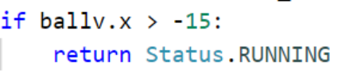
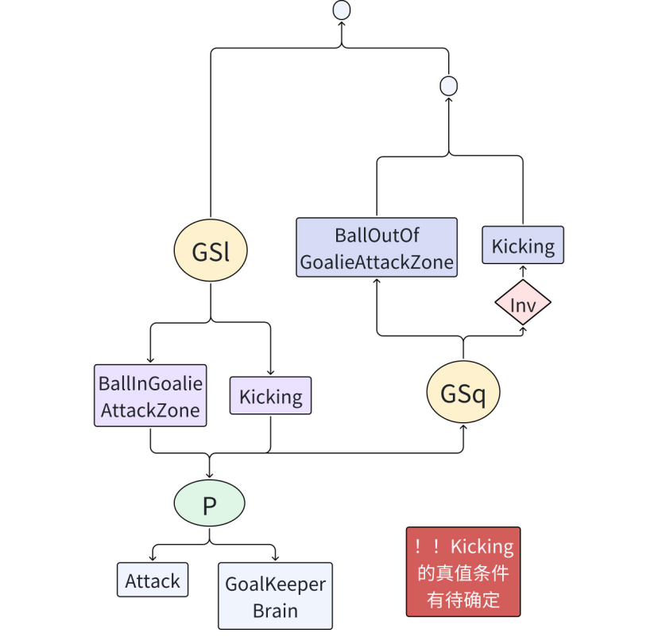
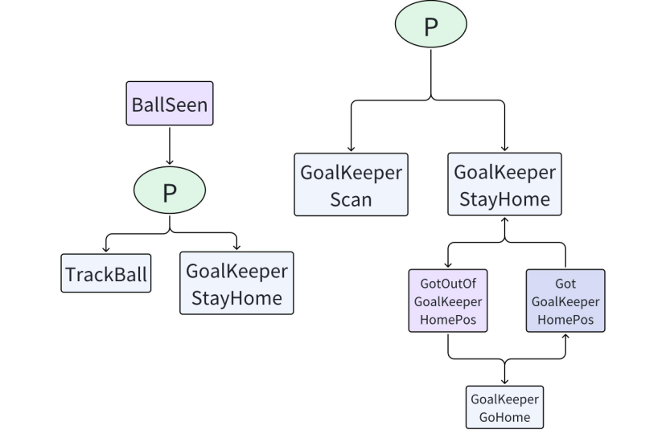
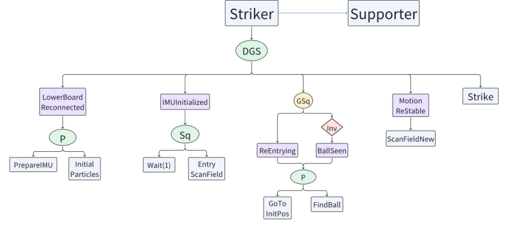
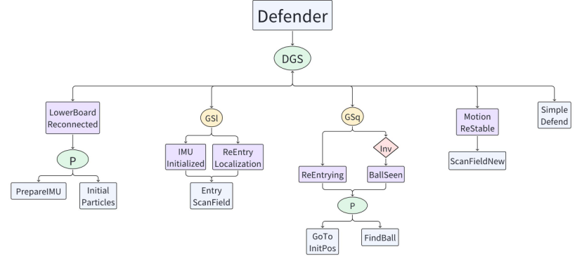

**Behavior module**

**老文档： Behavior module**

**Overview**

dancer-behavior是我们的策略模块，其主要由以下组件组成：

btree: 行为树（Behavior Tree），是我们策略的高层抽象

core: 基于btree模块，并且与我们机器人的实际相结合的底层抽象

role: 机器人的角色，如Striker、Defender等

skill: 机器人的技能，包含了头部与身体的技能，如SeekBall、Kick等

util: 一些实用函数或者封装

整个策略模块的运转流程如下：

0\. 初始化，读取Parameter Server中的参数，并设定初始Role

通过ROS Topic的订阅，接收视觉、步态、裁判盒以及队友的信息，并保存于DBlackboard中

若下位机已经开机，则根据当前的Role与DBlackboard中的信息，执行对应的Skill

Skill在执行完毕之后，会产生对应的身体动作BodyCommand与头部动作HeadCommand，两者合成ActionCommand，并通过ROS Topic发送给步态模块dancer-motion

一个运行周期结束，重复步骤1-4

**Behavior Tree**

参照\[Wiki\](https://github.com/libgdx/gdx-ai/wiki/Behavior-Trees)，btree是该文章的完整实现。

在Wiki需要关注的概念主要有：

Leaf task: Action与Condition

Branch task: Sequence、Selector与Parallel

Decorator

了解了基本概念之后，可以看dancer-behavior/src/dbehavior/btree中的示例。

**Core**

core组件主要有以下几个类：

DBlackboard: 主要负责订阅、保存与更新整个模块相关的参数，可以理解为一块写满了东西的黑板。

Role: 作为角色的基类，目前没有特殊功能。

Skill: 作为技能的基类，其中包含了一些基础的动作，以及对DBlackboard的访问

\-

**Role**

role组件中主要有以下角色：

Striker:

Defender:

Goalie:

Supporter:

除此之外，还有一些特殊的角色：

Normal:

Game:

Dummy:

Foo:

Fake:

**Skill**

skill组件中包含了许多常用技能。

**24国赛调试**

梳理从launch开始的启动流程，在哪里决定是否听裁判盒

与裁判盒联调，理解裁判盒各指令的意义

修改机器人的初始位置、开球后走到的位置

motion_info.lower_board_connected会影响哪些行为

teaminfo_outdated是不是太长了

环境变量在哪里设置的

如何让不同机器人的时钟同步？

info.field_quality < 0.5; 球在多远的时候位置的置信度最高，是越近越好吗？

避免机器人碰撞有两种方案：  
1) 如果自己是最近，就向队友声明是自己持球，队友走到合适的位置；如果自己不是最近（即有队友声明了，且自己判断一下队友的声明没问题），就走到合适的助攻点  
2) 两个striker选定一个作为决策者，只由他来判断谁持球谁助攻，并且向两个striker（包括自己）发送“去某点并踢球”或“只是去某点”的指令。  
方案2）可以扩展到四个机器人，且将来用强化学习时一定是这种；而方案1）与当前的架构比较接近，短期内更容易实现。  
要实现方案1），有以下技术问题需要考虑：  
1\. 持球者的决定属于覆盖式，开场时算出一个，此后每台机器人一直在循环地重算自己是不是最近，如果发现算出的结果和当前的kicker相矛盾，则发出新的声明。

**前置知识**

关于行为树的基础知识，可以阅读下列文档：

http://www.aisharing.com/archives/90

但是这个版本的行为树与机器人代码中的有差异，仅供初步了解。

若要进一步了解并调试机器人，请务必阅读下面的文档：

https://github.com/libgdx/gdx-ai/wiki/Behavior-Trees

**代码组成**

**类的继承关系**

**Leaf**

**\__init__ 列举了所有状态，状态被用作condition：**

.robot_status

硬件

进场状态

……

.ball_status

有没有看到

在哪个位置

离机器人的位置

.gc_status

裁判盒发不同指令的情形

.team_status

队友状态

至少有一个队员看到球

.field_status

看到中圈

看到球门？

**DBlackboard (dblackboard.py)**

**Role 各角色执行逻辑**

**Skill 各种技能**

**简单技能**

**复杂技能的技能树**

**StrikerBrain**

**AssistBall (assist.py)**

助攻

**class AssistBall(Parallel):**

总任务

**class GoToAssistPoint(Skill)**

根据球的位置和机器人角色计算出助攻点，并让机器人走过去

**Properties:**

助攻半径_assist_radius（r）_、传球距离_pass_dis_、远离标准_far_from_ball_、是否踢球_shoot_ball_

**Communication:**

from vision: 机器人位置_robot_pos_

**Method：**

先计算出球的全局位置，设定进攻目标点，算出目标点指向球的矢量。

随后分角色处理：GoalKeeper不助攻；Denfender去球被敌方推进到的下一个位置下方r处，不踢球。对于Supporter和Striker，如果球离球门较远，去球的前面（有什么用？）；离球门较近时，去球的后面。Striker去球的下方，Supporter去球的上方。

若机器人已经在助攻点，则原地不动；若不在，则发送去助攻点的动作指令。

**class GotAssist(ConditionLeaf)**

到达助攻点。

**class GotOutOfAssist(ConditionLeaf)**

不在助攻点。

**SeekBall (seek_ball.py)**

找球

**class SeekBall(DynamicGuardSelector)**

总任务。

**class TurnAround(Skill)**

机器人整体转过一个目标角后停止。

**Properties：**

起始角 _started_angle_ 初始化为机器人面对的方向

转过的角 _TARGET_ANGLE_DELTA_

目标角 _target_angle_，上面两者之和

**Method:**

机器人整体转过一个目标角后停止。

**class TurnTo(Skill)**

机器人整体转到一个目标角后停止。

**class ScanField(Skill)**

依次扫描一个列表中的所有点。其他含有ScanField的类均为其子类，仅限于修改properties的水平。

**Properties:**

在一个点的停留时间 timeout

计时器 timer = Timer(timeout)

扫描点列表 gaze_plats = \[VecPos(15, 90), VecPos(15, 0), VecPos(15, -90)\]

迭代器 iter

当前扫描点cur_plat

是否保持观察 keep

头的转速 pitch_speed

**Methods: ？？？**

转头以看向_gaze_plats_的一个点。如果已经到了，则计一段_timeout_时间，到时间后将当前扫描点改为下一个。若扫描到最后一个点，则反转_gaze_plats_元素顺序继续扫描。

**class TrackBall(Skill)**

通过旋转头部保证球在机器人视野中央。

**Properties：**

阈值_self.TRACK_THRESH，_头的转速_self.speed_

**Communication：**

From vision：球相对机器人的位置_ball_field_，以及由此位置算出的头部追踪俯仰角_track_（确实是在vision算的）

From motion：头部当前俯仰角_cur_plat_

**Method：**

若_ball_field_在中央，则固定；若不在中央，比较_cur_plat_和_track_，要求它们的差距在阈值内，否则通过look_at修改动作指令_action_cmd.headCmd_以调整。

**class GoToLastBall(Skill)**

若此时看不到球，则去最后一次看到球的位置

**Properties：**

阈值 _self.TRACK_THRESH（没用到）_

**Communication：**

通过goto_global修改动作指令_action_cmd.bodyCmd_

**Method：**

若此时看不到球，则去dblackboard上保存的最后一次看到球的位置，若没有这一位置则报错。

**class FindBall(DynamicGuardSelector)**

看到球则头跟着球转，看不到则扫描场地来找球

**class FindLastBall(Sequence)**

一边扫描场地一边去最后一次看到球的位置，过去之后扫描场地，转身，再扫描场地

**AttackBall (attack_ball.py && kick.py)**

**class AttackBall(DynamicGuardSelector)**

总任务

**class AfterAttack(Parallel)**

先回到正常站立状态，再接着找球

**class KickBrain(Skill)（未被调用）**

**class EnableKick(Condition) （未被调用）**

**class KickHead(Skill)**

踢球时头部动作。

看向pitch=15, yaw=0的位置，~~同时将自己的team_play_state设为KICKING（未实现）~~

**class GoKick(Skill)**

朝球走过去并踢球。

**Communication:**

From vision：球的全局位置_ball_global_

**Method:**

从dblackboard获取进攻目标点_attack_target，_计算ball->target矢量及其方位角，方位角作为踢球方向。将球的位置和踢球方向用action_generator.kick_ball打包好生成动作指令。

**class KickSide(Skill) （未被调用）**

朝左/右踢球（传给队友）

**GoalKeeper (goal_keeper.py)**

**class GoalKeeper(Role)**

总任务

**class GoalKeeperBase()**

守门员所在的禁区信息

**Properties:**

**\`attack_margin\`**：表示球相对于球门区域的位置，守门员应该进攻的位置。它是一个 **\`VecPos\`** 对象，具有 x 和 y 坐标。

**\`attack_margin_hys\`**：表示添加到进攻边界的滞后值。

**\`home_pos\`**：表示守门员的待命位置。

**\`home_x\`** 和 **\`home_y\`**：表示等待的距离到球门线的距离。

**\`home_dis_max\`** 和 **\`home_angle_max\`**：表示等待的最大可接受距离和角度。

**\`home_dis_max_hys\`** 和 **\`home_angle_max_hys\`**：表示最大可接受距离和角度的滞后值。

**\`next_state_size\`** 和 **\`next_state\`**：表示用于平滑下一个状态变化的缓冲区的长度和存储下一个状态的 deque。

**\`ball_ignore_x\`**：表示守门员应忽略球的 x 坐标位置。

**\`ball_ignore_x_hys\`**：表示忽略球的滞后距离。

**\`align_tol\`**：表示将守门员位置与最佳点对齐的容差值。

**\`kick_dis_max\`**：表示对手最大射门距离。

**\`target\`**：表示守门员的目标位置。

**\`target_smoothing_coff\`**：表示用于平滑目标位置的系数。

**\`margin_xy\`**：表示从放置者得到的值。

**\`state\`**：表示守门员当前的状态。

**\`timer\`**：表示计时器对象。

**\`home_pos\`**：表示守门员的待命位置。

**Method:**

buffered_set_state(self, state)向状态队列里添加新状态

**class BallInDanger(ConditionLeaf) 测一下场地上球的加速度？**

默认草地上球的加速度为-40cm/s^2（可以灵活调整，加速度绝对值越小BallInDanger越容易为True）

计算出机器人在2s反应时间后作出反应时球到达的x位置，若x为负，则返回True。

**class GoalieReadyToSave(ConditionLeaf, GoalKeeperBase)**

若机器人在球门前方（y坐标在球门宽度范围内）且面朝球门外侧，则返回True。

算出了待命位置的全局坐标赋给home_pos，但不在这里用到。

**class SaveBall(Skill)**

通过球的速度和在机器人坐标系中的位置，计算出球到机器人坐标系y轴时的y坐标，来决定向左倒/向右倒/正面防守。倒的条件或许可以严格一点，因为Attack也有防守效果且可把球踢出；正面防守没有动作，结束Saveball, DGS会接着选取Attack来防守。

**Graph1 SaveBall**

**class BallInGoalieAttackZone(ConditionLeaf)**

用球在机器人坐标系中的位置算

**class BallOutOfGoalieAttackZone(ConditionLeaf)**

用球的全局位置算

**class GoalKeeperBrain(Skill)**

与StrikerBrain/DefenderBrain类似，但目标点不同：

默认为VecPos(0, 300)，以避免踢到对方进攻队员身上。若球偏离场地x轴达到一定程度，则目标点也朝同一方向偏移一些。

**Graph2 Attack**

**class GoalKeeperScan(ScanField)**

是ScanField的子类，提供了新的一些扫描点，父类ScanField请参阅SeekBall技能。

**class GoalKeeperGoHome(Walk, GoalKeeperBase)**

回到待命点。

**class GotGoalKeeperHomePos(ConditionLeaf, GoalKeeperBase)**

在待命点且面朝球门外侧。

**class GotOutOfGoalKeeperHomePos(ConditionLeaf, GoalKeeperBase)**

不在待命点或面朝球门内侧。

**class GoalKeeperStayHome(DynamicGuardSelector)**

这部分的总任务，保证守门员在没有其他任务的条件下回到待命点，见下图。

**Graph3 Others**

**class GoalKeeperAlign(GoalKeeperBase)**

**class KeepGoal(DynamicGuardSelector)**

**class KeepGoalLogic(Parallel)**

**Util utility 多功能工具包**

**action_generator：指令生成器**

**parameter：**

**不连裁判盒的情况**

